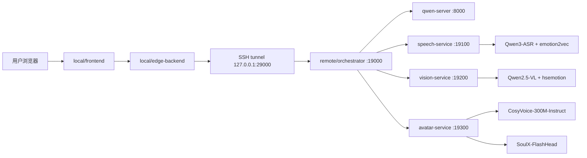

# A22 虚拟情感交流机器人系统

本仓库是服务外包创新创业大赛 A22 赛题的参赛工程，目标是构建一个可通过文本、语音和摄像头输入进行情感陪伴交流的数字人系统。当前版本采用“本地交互端 + 远端模型服务”的混合部署方式：本地负责网页交互、录音、摄像头采集和播放，远端负责大语言模型、多模态理解、语音识别、情绪识别、语音合成和数字人视频生成。

当前主流程已经打通：

- 文本输入到大语言模型回复。
- 麦克风语音输入到 ASR 识别，再进入对话流程。
- 摄像头开启后可附带视频关键帧，用于视觉上下文和表情情绪识别。
- LLM 回复经过 CosyVoice TTS 生成语音。
- TTS 音频经过 SoulX-FlashHead 生成数字人 MP4 视频和分段视频。
- 前端播放数字人视频，并支持两套数字人头像切换。
- orchestrator 内置轻量 RAG 知识库入口，用于心理支持知识增强。

## 系统架构



## 目录说明

```text
local/
  frontend/              # 本地网页前端，聊天、录音、摄像头、数字人展示
  edge-backend/          # 本地边缘后端，代理前端请求到远端 orchestrator

remote/
  orchestrator/          # 统一编排服务，融合文本、语音、视觉、RAG、数字人输出
  qwen-server/           # vLLM OpenAI API 兼容服务
  speech-service/        # ASR 与语音情绪识别服务
  vision-service/        # 视觉理解与人脸情绪识别服务
  avatar-service/        # TTS 与 SoulX 数字人视频生成服务

shared/                  # 前后端共享契约与数据结构
scripts/
  remote/                # 远端 tmux 启停、环境检查脚本
  release/               # 比赛提交打包脚本

System_Design/
  submission/            # 项目概要介绍、项目详细方案等提交材料
```

## 当前远端环境约定

远端服务器默认路径如下：

```bash
代码目录: /root/autodl-tmp/a22/code/FuChuangSai_A22
模型目录: /root/autodl-tmp/a22/models
虚拟环境: /root/autodl-tmp/a22/.uv_envs
临时目录: /root/autodl-tmp/a22/tmp
日志目录: /root/autodl-tmp/a22/logs
```

远端 5 个核心服务：

| 服务 | 端口 | 主要职责 |
| --- | --- | --- |
| qwen-server | 8000 | vLLM 加载 Qwen2.5-7B-Instruct |
| speech-service | 19100 | Qwen3-ASR 语音识别，emotion2vec 语音情绪 |
| vision-service | 19200 | Qwen2.5-VL 视觉理解，hsemotion 人脸情绪 |
| avatar-service | 19300 | CosyVoice TTS，SoulX 数字人视频生成 |
| orchestrator | 19000 | 对话编排、多模态融合、RAG、调用数字人服务 |

## 当前使用模型

当前运行链路需要的模型目录位于 `/root/autodl-tmp/a22/models`：

| 模型目录 | 用途 |
| --- | --- |
| Qwen2.5-7B-Instruct | 主对话大语言模型 |
| Qwen3-ASR-1.7B | 中文语音识别 |
| Qwen2.5-VL-7B-Instruct | 视频关键帧/图片理解 |
| CosyVoice-300M-Instruct | TTS 语音合成 |
| CosyVoice | CosyVoice 代码依赖路径 |
| SoulX-FlashHead | 数字人推理工程 |
| SoulX-FlashHead-1_3B | SoulX 权重 |
| wav2vec2-base-960h | SoulX 音频特征依赖 |
| emotion2vec_plus_base | 语音情绪识别 |
| hsemotion | 人脸表情情绪识别 |

不在当前主流程里的模型不建议放入 500M 比赛提交压缩包。模型参数文件通常体积很大，应作为外部部署资源或单独说明。

## 快速启动

### 1. 远端启动 5 个模型服务

在本地 PowerShell 先登录远端：

```powershell
ssh -p 57547 root@connect.bjb1.seetacloud.com
```

在远端 Linux 执行：

```bash
cd /root/autodl-tmp/a22/code/FuChuangSai_A22
source /etc/network_turbo || true

# 如远端有临时本地改动，先保存，避免 pull 被阻塞
git stash push -u -m "tmp-before-run-$(date +%F_%T)" || true
git pull --ff-only

chmod +x scripts/remote/*.sh
./scripts/remote/stop_remote_stack_tmux.sh
./scripts/remote/start_remote_stack_tmux.sh

# 健康检查
curl -iS http://127.0.0.1:19000/health
curl -iS http://127.0.0.1:19300/health
```

查看服务：

```bash
tmux ls
ss -ltnp | egrep ':8000|:19000|:19100|:19200|:19300'
```

查看日志：

```bash
tmux capture-pane -pt orchestrator -S -200
tmux capture-pane -pt avatar -S -260
```

### 2. 本地开启 SSH 隧道

新开一个本地 PowerShell 窗口，保持不关闭：

```powershell
ssh -N -g -o ExitOnForwardFailure=yes -o ServerAliveInterval=30 -o ServerAliveCountMax=3 -L 0.0.0.0:29000:127.0.0.1:19000 -p 57547 root@connect.bjb1.seetacloud.com
```

隧道含义：本地 `http://127.0.0.1:29000` 会转发到远端 orchestrator `http://127.0.0.1:19000`。

### 3. 本地启动前端和边缘后端

在另一个本地 PowerShell 窗口执行：

```powershell
cd C:\Users\FYF\Documents\GitHub\FuChuangSai_A22

# 首次或配置变更时确认 local/frontend/.env.local
@"
VITE_USE_DIRECT_API=false
VITE_API_PROXY_TARGET=http://127.0.0.1:29000
VITE_AVATAR_SESSION_ID=demo_s1
VITE_AVATAR_STREAM_ID=demo_stream_1
"@ | Set-Content local\frontend\.env.local -Encoding UTF8

docker compose -f compose.yaml -f compose.local.yaml up -d frontend edge-backend
docker compose -f compose.yaml -f compose.local.yaml ps
```

浏览器打开：

```text
http://localhost:3000
```

如果页面打不开或旧代码没有刷新：

```powershell
docker compose -f compose.yaml -f compose.local.yaml restart frontend edge-backend
docker compose -f compose.yaml -f compose.local.yaml logs --tail 120 frontend edge-backend
```

## 远端接口自检

直接测试 orchestrator：

```bash
TURN=10001
curl -sS -X POST "http://127.0.0.1:19000/chat" \
  -H "Content-Type: application/json" \
  -d "{\"session_id\":\"demo_s1\",\"turn_id\":$TURN,\"user_text\":\"你好，请给我一句鼓励。\",\"input_type\":\"text\"}" \
  | python -m json.tool
```

直接测试 avatar-service：

```bash
TURN=10002
curl -sS -X POST "http://127.0.0.1:19300/generate" \
  -H "Content-Type: application/json; charset=utf-8" \
  --data-raw "{
    \"session_id\":\"demo_s1\",
    \"turn_id\":$TURN,
    \"reply_text\":\"这是数字人联调测试。\",
    \"emotion_style\":\"supportive\",
    \"avatar_action\":{\"facial_expression\":\"smile\",\"head_motion\":\"nod\"},
    \"turn_time_window\":{\"stream_id\":\"demo_stream_1\"}
  }" | python -m json.tool
```

生成文件默认在：

```bash
/root/autodl-tmp/a22/tmp/avatar/demo_s1/<turn_id>/
```

## 数字人配置

avatar-service 默认使用 SoulX-FlashHead：

```bash
SOULX_ROOT=/root/autodl-tmp/a22/models/SoulX-FlashHead
SOULX_CKPT_DIR=/root/autodl-tmp/a22/models/SoulX-FlashHead-1_3B
SOULX_WAV2VEC_DIR=/root/autodl-tmp/a22/models/wav2vec2-base-960h
SOULX_PYTHON=/root/autodl-tmp/a22/.uv_envs/soulx-full/bin/python
TTS_MODE=cosyvoice_300m_instruct
TTS_MODEL=/root/autodl-tmp/a22/models/CosyVoice-300M-Instruct
TTS_SPEAKER_ID=中文女
```

前端支持 `avatar_a` 和 `avatar_b` 两个数字人配置。切换按钮会同时更新前端展示头像，并把 `avatar_profile_id` 传给远端，avatar-service 根据对应参考图生成后续视频。

## RAG 知识库

orchestrator 已包含轻量 RAG 模块和知识库目录：

```text
remote/orchestrator/knowledge_base/
remote/orchestrator/services/rag/
```

RAG 用于给心理支持类对话提供更稳定的知识提示。它属于 orchestrator 的代码和索引资源，不等同于额外大模型权重。

## 比赛提交打包

比赛压缩包限制为 500M 以内时，不应把完整模型目录或 Docker 镜像 tar 放进最终压缩包。建议提交结构：

```text
01_software_install_package/     # 可运行代码、脚本、compose 配置
02_digital_human_project/        # 数字人服务工程文件
03_speech_recognition_project/   # 语音识别服务工程文件
docs/                            # 项目概要介绍、项目详细方案、部署说明
demo/                            # 演示视频或演示视频说明
```

已有提交文档：

```text
System_Design/submission/项目概要介绍.md
System_Design/submission/项目详细方案.md
```

打包脚本：

```bash
cd /root/autodl-tmp/a22/code/FuChuangSai_A22
chmod +x scripts/release/package_competition_submission.sh

bash scripts/release/package_competition_submission.sh \
  --project-name A22_Final \
  --out-dir /root/autodl-tmp/a22/dist/submission_500m \
  --skip-images \
  --skip-models \
  --skip-build \
  --skip-rag-build
```

如果需要额外生成“软件安装包”压缩文件，可在脚本生成的提交目录内只压缩代码和配置，不包含 `models`、`.uv_envs`、日志、临时文件和视频缓存。

## 常见问题

### git pull 被本地改动阻塞

远端服务器经常会有临时改动。拉取前先执行：

```bash
git status -sb
git stash push -u -m "tmp-before-pull-$(date +%F_%T)" || true
git pull --ff-only
```

### 端口被占用或服务残留

```bash
./scripts/remote/stop_remote_stack_tmux.sh
pkill -f "vllm.entrypoints.openai.api_server" 2>/dev/null || true
pkill -f "uvicorn app:app" 2>/dev/null || true
./scripts/remote/start_remote_stack_tmux.sh
```

### 前端提示 Request failed

优先检查：

```powershell
# 本地隧道窗口是否仍在运行
curl http://127.0.0.1:29000/health

# Docker 容器是否正常
docker compose -f compose.yaml -f compose.local.yaml ps
docker compose -f compose.yaml -f compose.local.yaml logs --tail 120 frontend edge-backend
```

### 数字人视频不更新

检查远端：

```bash
curl -iS http://127.0.0.1:19300/health
tmux capture-pane -pt avatar -S -260
ls -lah /root/autodl-tmp/a22/tmp/avatar/demo_s1/
```

### 浏览器语音播放异常

不同浏览器、翻译插件、麦克风权限和自动播放策略可能影响音频播放。演示时建议固定使用同一个浏览器，并关闭网页翻译插件。

## 开发注意

- 远端模型路径统一使用 `/root/autodl-tmp/a22/models`，不要再写旧服务器路径。
- 不要把模型权重、`.uv_envs`、临时视频和日志提交到 Git。
- 修改远端代码的推荐流程是：本地修改并提交推送，远端 `git pull --ff-only` 后重启服务。
- 复杂功能改动前先确认当前演示流程可运行，避免破坏已有联调链路。
