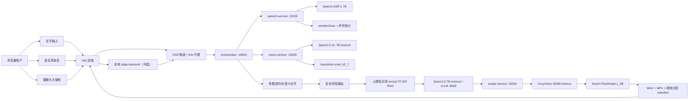

# A22 情感陪伴数字人系统：完整项目交接说明

> 生成日期：2026-08-13  
> 仓库：`FuChuangSai_A22`  
> 当前分支：`main`  
> 当前已提交基线：`72af530`（`fix(speech): tolerate qwen asr without use_itn kwarg`）  
> 重要状态：当前工作区存在尚未提交的前端中文化、启动脚本、评测、打包和桌面机器人扩展改动。本文件描述的是“已提交代码 + 当前工作区”的综合现状，不代表所有内容都已经推送到 GitHub。

---

## 0. 给新聊天的最短交接说明

这是一个面向情感陪伴场景的多模态数字人系统。浏览器支持文字、麦克风语音和摄像头关键帧输入；远端依次完成 ASR、语音情绪识别、视觉语义/人脸情绪识别、多模态对齐、风险路由、心理知识库 RAG、上下文对话、TTS 和 SoulX 数字人视频生成；前端展示对话、状态、可切换数字人形象，并播放远端返回的视频。

当前主流程使用：

```text
Qwen3-ASR-1.7B
  + emotion2vec_plus_base
  + Qwen2.5-VL-7B-Instruct
  + hsemotion/enet_b2_7
  -> orchestrator 多模态对齐 + 安全路由 + 心理知识库 RAG + 会话记忆
  -> Qwen2.5-7B-Instruct
  -> CosyVoice-300M-Instruct（固定“中文女”）
  -> SoulX-FlashHead-1_3B
  -> MP4/分段 manifest
```

远端代码和模型的真实路径是：

```text
/root/autodl-tmp/a22/code/FuChuangSai_A22
/root/autodl-tmp/a22/models
/root/autodl-tmp/a22/.uv_envs
/root/autodl-tmp/a22/tmp
/root/autodl-tmp/a22/logs
```

远端主启动脚本：

```bash
./scripts/remote/stop_remote_stack_tmux.sh
./scripts/remote/start_remote_stack_tmux.sh
```

本地 Docker 前端：

```powershell
docker compose -f compose.yaml -f compose.local.yaml up -d frontend edge-backend
```

浏览器地址：`http://localhost:3000/`。

演示 10 轮以上上下文前，需要把 orchestrator 的：

```bash
MAX_CONTEXT_MESSAGES=30
CONTEXT_SUMMARY_TURNS=20
```

写入远端 `/root/autodl-tmp/a22/env.sh`，然后重启远端服务。默认值分别只有 `8` 和 `4`。

---

## 1. 项目定位

### 1.1 原始赛题定位

项目最初面向服务外包创新创业大赛 A22“虚拟情感交流机器人系统”，目标是实现一个能够理解用户文字、语音和视觉状态，并以自然语言、语音和数字人视频进行情感陪伴的系统。

核心价值不是医学诊断，而是：

1. 通过文字、语音和摄像头画面获取用户当前状态。
2. 将语音内容、声学情绪、人脸表情和视觉场景统一到同一轮对话中。
3. 结合多轮上下文和心理支持知识库生成有边界、可执行、低负担的支持性回复。
4. 用稳定女声 TTS 和可切换的数字人形象呈现回复。
5. 对潜在高风险表达进行单独路由，优先安全确认和线下求助建议。

### 1.2 后续桌面机器人扩展

仓库当前还出现了面向“桌面情感陪伴机器人”的扩展原型：

```text
local/robot-runtime/
compose.robot.yaml
scripts/robot/
System_Design/robot_v1/
```

它用于把原数字人系统的语言理解、情绪识别和 TTS 能力映射到实体机器人的双 OLED 眼睛、二自由度头部和扬声器。当前硬件驱动默认是 `mock`，因此这部分是“可继续完善的机器人扩展”，不是现有数字人演示的必需依赖，也尚未全部提交。

### 1.3 使用边界

系统是情感陪伴和心理健康教育辅助工具，不是医生、心理咨询师或急救服务。系统不应：

- 输出医学诊断结论。
- 给出处方、停药、换药建议。
- 对高风险用户只做普通安慰。
- 声称知识库中不存在的专业依据。

---

## 2. 系统总体架构

### 2.1 设计架构



### 2.2 当前演示部署的真实请求路径

当前 `local/frontend/.env.local` 是：

```env
VITE_USE_DIRECT_API=false
VITE_API_PROXY_TARGET=http://host.docker.internal:29000
VITE_AVATAR_SESSION_ID=demo_s1
VITE_AVATAR_STREAM_ID=demo_stream_1
```

因此 Docker 前端中的 `/api/chat` 和 `/media/...` 会被 Vite 代理到宿主机 `29000`，再由 SSH 隧道转发到远端 orchestrator 的 `19000`。

当前演示的实际路径是：

```text
浏览器 -> frontend 容器/Vite -> host.docker.internal:29000
       -> SSH local forward -> 远端 127.0.0.1:19000/orchestrator
```

`edge-backend` 仍然可以启动，也保留了转发、输入预处理和机器人扩展能力，但在上述 `.env.local` 配置下，它不是浏览器请求的必经节点。后续若要严格使用边缘后端，应让前端代理指向 Docker 网络中的 `edge-backend:8000`，而不是 `29000`。

---

## 3. 一轮对话的完整执行顺序

`remote/orchestrator/services/dialog_service.py` 的实际执行顺序如下：

1. 接收 `/chat` 请求，识别 `session_id`、`turn_id`、输入类型、音频、视频帧和数字人 profile。
2. 调用 speech-service：
   - 音频转写为文本。
   - 提取时长、采样率、语速、停顿、能量、近似音高等声学特征。
   - 调用 emotion2vec 得到语音情绪标签。
3. 调用 vision-service：
   - Qwen2.5-VL 输出场景、注意方向、运动水平、情绪标签。
   - hsemotion 对人脸区域进行表情分类。
4. 多模态对齐：
   - 使用同一 `session_id`、`turn_id`、`stream_id`、`TurnTimeWindow` 对齐本轮数据。
   - 把语音和视觉结果压缩为 LLM 可读的文本上下文。
5. 情绪融合：
   - 优先寻找语音和视觉标签的交集。
   - 无交集时优先视觉标签，再退到语音标签。
6. 安全路由：
   - 普通对话：`normal`。
   - 心理支持主题：`support`。
   - 自伤、轻生、极端失眠、明显失控等表达：`risk_escalation`。
7. RAG 检索：
   - 根据文本、语音上下文、视觉上下文和安全路由扩展检索词。
   - 从心理支持知识库中取 Top-K 片段。
8. 会话上下文：
   - 从内存中的同一 `session_id` 历史消息取最近若干条。
   - 生成近期上下文摘要。
9. 调用 Qwen2.5-7B-Instruct 生成回复。
10. 根据回复风格生成 TTS 计划和数字人动作。
11. 调用 avatar-service：
   - CosyVoice 合成 WAV。
   - SoulX 根据选中的参考图和 WAV 生成 MP4。
   - 生成视频分段和 manifest。
12. orchestrator 返回文字、情绪风格、动作、音频、视频 URL、多模态证据和推理提示。
13. 前端将用户消息和数字人回复分别显示成独立卡片，并播放数字人视频。

当前 orchestrator 对 speech 和 vision 的调用是串行 `await`，不是并行执行，因此音频、视觉和数字人生成延迟会累加。

---

## 4. 项目所有主要组成

### 4.1 顶层目录

| 路径 | 作用 | 当前状态 |
| --- | --- | --- |
| `local/frontend` | 浏览器交互界面、录音、摄像头采帧、聊天记录、数字人播放 | 主流程使用；当前有未提交中文化/UI 修改 |
| `local/edge-backend` | 本地轻量预处理和远端转发 | 可用；当前演示配置可能绕过 |
| `local/robot-runtime` | 桌面机器人本地运行时，映射眼睛/舵机/音频 | 新增扩展，未提交，默认 mock |
| `remote/qwen-server` | vLLM OpenAI 兼容服务 | 主流程使用 |
| `remote/speech-service` | ASR、语音特征、SER | 主流程使用 |
| `remote/vision-service` | 视觉语义和 FER | 主流程使用 |
| `remote/avatar-service` | TTS、数字人视频、媒体接口 | 主流程使用 |
| `remote/orchestrator` | 总编排、上下文、RAG、安全路由、LLM、avatar 调用 | 主流程核心 |
| `shared/contracts` | 前后端公共 Pydantic 契约和接口文档 | 主流程使用 |
| `scripts/remote` | 远端环境检查、五服务启停、avatar 单独重启 | 主流程运维 |
| `scripts/evaluation` | 数据检查、ASR 自动评测、官方数字人指标辅助脚本 | 新增评测工具，未提交 |
| `scripts/release` | 比赛提交打包脚本 | 已有脚本，当前有未提交更新 |
| `scripts/robot` | 桌面机器人扩展脚本 | 新增扩展，未提交 |
| `System_Design` | 架构、运行手册、改动记录、申报材料、机器人设计 | 文档集合 |
| `a22_demo` | 早期 UE/Audio2Face 桥接实验 | 旧/实验路径，非当前 SoulX 主流程 |
| `submission_500m` | 500 MB 限制下的提交包 staging 和检查结果 | 本地生成物，不应盲目提交到 Git |
| `tmp`、`logs` | 运行时文件和日志 | 不应作为正式源码提交 |

### 4.2 远端五服务

| tmux 会话 | 端口 | 服务 | 核心职责 |
| --- | ---: | --- | --- |
| `qwen` | 8000 | vLLM Qwen server | 主对话模型 OpenAI 兼容 API |
| `speech` | 19100 | speech-service | ASR、声学特征、语音情绪 |
| `vision` | 19200 | vision-service | 多帧视觉语义、人脸表情 |
| `avatar` | 19300 | avatar-service | TTS、SoulX 视频、媒体文件 |
| `orchestrator` | 19000 | orchestrator | 整体编排、RAG、记忆和统一 API |

### 4.3 主要 API

| 服务 | 方法和路径 | 说明 |
| --- | --- | --- |
| orchestrator | `GET /health` | 主服务健康检查 |
| orchestrator | `POST /chat` | 统一对话入口 |
| orchestrator | `WS /ws/chat` | WebSocket 对话入口 |
| orchestrator | `GET /media/video/{session}/{turn}` | 代理完整 MP4 |
| orchestrator | `GET /media/video-chunk/{session}/{turn}/{index}` | 代理视频分段 |
| orchestrator | `GET /media/video-stream/{session}/{turn}/manifest` | 代理分段清单 |
| speech | `GET /health` | ASR/SER 健康检查 |
| speech | `POST /transcribe` | JSON + Base64 音频转写 |
| vision | `GET /health` | 视觉服务健康检查 |
| vision | `POST /extract` | 视频关键帧特征抽取 |
| avatar | `GET /health` | TTS/avatar 健康检查 |
| avatar | `POST /generate` | 文字 -> WAV -> MP4 |
| avatar | `WS /ws/avatar` | 数字人事件推送 |
| local edge | `GET /health` | 本地边缘服务健康检查 |
| local edge | `POST /chat` | 输入预处理和远端转发 |
| robot runtime | `GET /health` | 桌面机器人运行时健康检查 |
| robot runtime | `POST /v1/chat/text` | 机器人文字交互 |
| robot runtime | `POST /v1/eyes/expression` | OLED 眼睛表情 |
| robot runtime | `POST /v1/head/pose` | 二自由度头部姿态 |

---

## 5. 当前实际使用的模型

| 功能 | 模型/实现 | 服务器路径 | 是否主流程必需 |
| --- | --- | --- | --- |
| 主对话 LLM | Qwen2.5-7B-Instruct | `/root/autodl-tmp/a22/models/Qwen2.5-7B-Instruct` | 是 |
| ASR | Qwen3-ASR-1.7B | `/root/autodl-tmp/a22/models/Qwen3-ASR-1.7B` | 语音输入需要 |
| 语音情绪 SER | emotion2vec_plus_base | `/root/autodl-tmp/a22/models/emotion2vec_plus_base` | 情绪增强需要 |
| 视觉语义 | Qwen2.5-VL-7B-Instruct | `/root/autodl-tmp/a22/models/Qwen2.5-VL-7B-Instruct` | 摄像头输入需要 |
| 人脸情绪 FER | hsemotion/enet_b2_7 | `/root/autodl-tmp/a22/models/hsemotion`（缓存/映射目录） | 摄像头情绪需要 |
| TTS | CosyVoice-300M-Instruct | `/root/autodl-tmp/a22/models/CosyVoice-300M-Instruct` | 数字人语音需要 |
| TTS 源码依赖 | CosyVoice 仓库 | `/root/autodl-tmp/a22/models/CosyVoice` | 是 |
| 数字人驱动 | SoulX-FlashHead-1_3B | `/root/autodl-tmp/a22/models/SoulX-FlashHead-1_3B` | 数字人视频需要 |
| SoulX 工程 | SoulX-FlashHead | `/root/autodl-tmp/a22/models/SoulX-FlashHead` | 是 |
| SoulX 音频编码 | wav2vec2-base-960h | `/root/autodl-tmp/a22/models/wav2vec2-base-960h` | 是 |
| RAG 检索 | 项目自实现 lexical TF-IDF | `remote/orchestrator/knowledge_base` | 心理知识库需要 |

不是当前主流程必需的旧模型目录可能包括：

```text
Belle-whisper-large-v3-turbo-zh
CosyVoice-300M-SFT
CosyVoice2-0.5B
echomimic_v2
echomimic_v3_flash
Fun-CosyVoice3-0.5B-2512
```

注意：不能仅凭目录名删除服务器模型。正式清理前应先根据启动脚本、运行日志和当前服务环境确认没有其他实验链路引用。

---

## 6. 多模态输入与情绪理解

### 6.1 文字输入

文字直接作为本轮的 canonical user text，进入风险路由、RAG、上下文和 LLM。

### 6.2 语音输入

前端录音结束后生成 PCM16 WAV，并以 Base64 放入请求。speech-service 返回：

- `transcript_text`
- `audio_meta`
- `speaking_rate`
- `pause_ratio`
- `rms_energy`
- `peak_level`
- `pitch_hz`（过零率近似，不是严格基频算法）
- emotion2vec 标签和置信度

这些结果会进入 `multimodal_result.evidence`，并参与风险路由和 LLM 上下文。

### 6.3 摄像头输入

前端不是持续上传完整视频流，而是维护滚动关键帧缓存，在用户发起一轮对话时从对应时间窗中抽取若干 JPEG 关键帧。当前典型参数：

| 参数 | 当前值 |
| --- | ---: |
| 后台采样间隔 | 1400 ms |
| 缓存长度 | 12 s |
| 触发前窗口 | 4 s |
| 触发后窗口 | 0.8 s |
| 前端最多候选帧 | 6 |
| edge 默认远端帧上限 | 3 |
| JPEG 质量 | 0.62 |
| 最大边长 | 480 px |

Qwen2.5-VL 实际接收的是多张独立图片，不是原生 video tensor。hsemotion 另外对人脸区域做分类。两者共同构成视觉上下文。

### 6.4 情绪如何影响最终回复

语音和视觉情绪不是只显示在状态栏。它们会：

1. 进入多模态对齐后的 LLM user prompt。
2. 影响 `safety_router` 的主题判断。
3. 影响 `policy_service` 选择回复情绪风格、数字人表情和头部动作。
4. 写入返回结果中的 `multimodal_result`，可用于演示证据。

因此，开启摄像头后，只有在本轮发送文字或语音时，缓存帧才会随该轮请求上传并参与分析；单纯打开摄像头但不发送一轮请求，不会自动产生远端情绪判断。

---

## 7. RAG、心理知识库与安全路由

### 7.1 当前 RAG 不是向量数据库

配置中虽然保留了：

```text
RAG_EMBEDDING_MODEL=BAAI/bge-small-zh-v1.5
```

但当前索引实际是项目自实现的 lexical TF-IDF 检索，不会加载 BGE 模型。知识库会被切分为 chunks，建立词项索引，再按路由主题、文本匹配和最低分数筛选。

默认配置：

```text
RAG_ENABLED=true
RAG_TOP_K=4
RAG_MAX_CONTEXT_CHARS=2500
RAG_MIN_SCORE=0.08
RAG_REBUILD_ON_START=false
```

### 7.2 知识库主题

`remote/orchestrator/knowledge_base/raw` 包含：

- 焦虑表现、日常支持、升级求助、焦虑与睡眠。
- 抑郁表现、支持方式、升级求助。
- 睡眠支持和严重失眠风险。
- 压力和情绪调节。
- 双相/躁狂风险提示和安全回应。
- 老年孤独、家庭陪伴、家属沟通。
- 自伤/轻生安全升级。
- 共情、澄清、鼓励类回复模板。

### 7.3 路由类型

| 路由 | 触发条件 | 行为 |
| --- | --- | --- |
| `normal` | 无心理支持关键词 | 不检索知识库，只使用 persona |
| `support` | 焦虑、低落、睡眠、压力、孤独等主题 | 检索 core/dialogue 知识 |
| `risk_escalation` | 自伤、轻生、极端失眠、明显失控等高风险表达 | 检索安全材料，强制安全边界 |

### 7.4 剧本用词注意

当前高风险模式中包含“停不下来”。如果用户只是表达普通紧张，却说“整个人绷着，停不下来”，系统会直接进入高风险路由。演示普通焦虑阶段应说：

```text
我也说不好，就是整个人绷着，放松不下来。你说我这算严重吗？
```

真正需要展示高风险升级时，再使用被动轻生表达，观察系统是否优先确认安全和建议联系可信赖的人/专业资源。

---

## 8. 会话记忆和上下文长度

### 8.1 当前实现

会话历史保存在 orchestrator 进程内存中，键是 `session_id`。每轮完成后追加：

```text
user message
assistant message
```

旧版默认：

```text
MAX_CONTEXT_MESSAGES=8
CONTEXT_SUMMARY_TURNS=4
```

`MAX_CONTEXT_MESSAGES=8` 表示只给主 LLM 最近 8 条消息，约等于 4 轮用户-助手对话，不足以可靠支撑 12 轮总结。当前部署已将默认值提升为 30 条消息；`CONTEXT_SUMMARY_TURNS` 仍按“消息条数”截取，不是完整对话轮数。

### 8.2 录制 12 轮演示前的推荐设置

最稳妥的方法是编辑远端：

```text
/root/autodl-tmp/a22/env.sh
```

加入：

```bash
export MAX_CONTEXT_MESSAGES=30
export CONTEXT_SUMMARY_TURNS=4
```

然后重启远端五服务：

```bash
cd /root/autodl-tmp/a22/code/FuChuangSai_A22
./scripts/remote/stop_remote_stack_tmux.sh
./scripts/remote/start_remote_stack_tmux.sh
```

只需重启远端 orchestrator 所在服务栈；本地前端和 SSH 隧道不必重启。刷新页面会创建新的前端状态，但同一个 `session_id` 的远端内存历史只有在 orchestrator 重启后才会清空。

### 8.3 局限

- 会话历史只在进程内存，不会写入数据库。
- orchestrator 重启后历史消失。
- 多个用户若错误共用 `demo_s1`，会共享同一份上下文。
- 当前 summary 是拼接最近消息，不是独立摘要模型。

---

## 9. 数字人、TTS 和多形象切换

### 9.1 TTS

当前主流程：

```text
TTS_MODE=cosyvoice_300m_instruct
TTS_MODEL=/root/autodl-tmp/a22/models/CosyVoice-300M-Instruct
TTS_SPEAKER_ID=中文女
```

已经做过的稳定性修正：

- 固定默认 speaker 为“中文女”，避免运行时回退到随机或错误音色。
- 在 TTS 前清理 Markdown 的 `*`、`-` 等标记，避免被读出。
- 保留完整 LLM 回复给 TTS/video，不再只取第一句。

浏览器扩展、浏览器翻译/朗读或多个页面同时播放，也可能造成“中途像换音色”的假象。之前最终确认过一次问题来自使用了另一个浏览器及其音频处理，而不是服务器环境被污染。

### 9.2 SoulX

当前 SoulX 命令模板：

```bash
/root/autodl-tmp/a22/.uv_envs/soulx-full/bin/python generate_video.py \
  --ckpt_dir /root/autodl-tmp/a22/models/SoulX-FlashHead-1_3B \
  --wav2vec_dir /root/autodl-tmp/a22/models/wav2vec2-base-960h \
  --model_type lite \
  --cond_image {ref_image_path} \
  --audio_path {audio_path} \
  --audio_encode_mode stream \
  --save_file {output_path}
```

当前默认：

```text
SOULX_CHUNK_SECONDS=2.0
SOULX_FPS=25
SOULX_ASYNC_RENDER=false
```

虽然 SoulX 支持分段输出，当前为了稳定性默认同步渲染。同步模式意味着 `/chat` 会等待数字人视频生成完成，所以首包延迟较明显，但不会出现异步 manifest 永久为空的失败状态。

### 9.3 多数字人切换

前端有 `avatar_a`、`avatar_b` 两个 profile。切换时：

1. 前端立即更换静态参考图。
2. 在下一轮 `/chat` 请求中发送 `avatar_profile_id`。
3. orchestrator 根据环境映射得到远端参考图路径。
4. avatar-service 用该参考图生成下一段视频。

参考图解析优先级：

```text
请求中的 avatar_ref_image_path
  > avatar_profile_id 对应映射
  > 默认 profile 映射
  > avatar-service 自身 SOULX_REF_IMAGE_PATH
```

默认 profile 路径来自当前数字人 A 的参考图；数字人 B 映射到仓库中的 `local/frontend/public/avatar-portrait-alt.jpg`，前端静态展示与 LiveAvatar 生成共用该文件。

---

## 10. 前端功能现状

### 10.1 已有功能

- 中文页面标题、按钮、状态文案。
- 每条系统提示、用户输入、数字人回复独立卡片显示。
- 文字输入。
- 语音录制，录音中用醒目的“正在录音中”覆盖输入框。
- 摄像头开启/关闭和关键帧缓存。
- 数字人静态图、MP4 和分段视频播放。
- 数字人 A/B 形象切换。
- 会话、stream、轮次、传输、输入模式、情绪、动作等运行状态。
- 请求处理中禁用重复发送。

### 10.2 当前未提交的 UI 内容

当前工作区中以下前端文件已修改但未提交：

```text
local/frontend/index.html
local/frontend/src/api/chat.js
local/frontend/src/main.js
local/frontend/src/ui/AvatarPanel.js
local/frontend/src/ui/CameraPanel.js
local/frontend/src/ui/ChatPanel.js
local/frontend/src/ui/InputBar.js
local/frontend/src/ui/StatusBar.js
```

以及新增：

```text
local/frontend/src/ui/displayText.js
```

其中 `ChatPanel.js` 已修正为和现有 CSS 一致的：

```text
chat-panel
message-card user
message-card assistant
message-card system
```

这是为了解决中文化后聊天记录不再被独立边框包住、无法区分“我”和“数字人助手”的问题。

### 10.3 换行风险

当前 Windows 工作区提示多个文件下次 Git 接触时会从 LF 转为 CRLF。Linux 远端 Shell 脚本必须保持 LF，否则可能出现：

```text
/usr/bin/env: 'bash\r': No such file or directory
```

提交前应检查 `.gitattributes` 或执行：

```powershell
git diff --check
```

不要对 Shell 脚本做无意义的全文件换行转换。

---

## 11. 远端服务器目录和 Python 环境

### 11.1 目录

```text
/root/autodl-tmp/a22/
  code/FuChuangSai_A22/
  models/
  .uv_envs/
  tmp/
  logs/
  env.sh
```

不要再使用旧服务器上的 `zifeng` 等路径。启动脚本当前会根据自身位置推导 `REPO_ROOT`，并忽略 `env.sh` 中指向其他仓库的过期 `A22_CODE`。

### 11.2 虚拟环境

```text
/root/autodl-tmp/a22/.uv_envs/qwen-server
/root/autodl-tmp/a22/.uv_envs/speech-service
/root/autodl-tmp/a22/.uv_envs/vision-service
/root/autodl-tmp/a22/.uv_envs/avatar-service
/root/autodl-tmp/a22/.uv_envs/orchestrator
/root/autodl-tmp/a22/.uv_envs/soulx-full
```

avatar-service 本身使用 `avatar-service` 环境，但启动 SoulX 子进程时必须使用 `soulx-full/bin/python`，不能把两个环境混为一个。

---

## 12. 从零启动：远端服务

### 12.1 登录

服务器端口可能随 AutoDL 实例变化，使用占位符：

```powershell
ssh -p <SSH_PORT> root@connect.bjb1.seetacloud.com
```

也可以在 Windows `~/.ssh/config` 中定义：

```sshconfig
Host autodl-a22
    HostName connect.bjb1.seetacloud.com
    User root
    Port <SSH_PORT>
    PreferredAuthentications password
    PubkeyAuthentication no
    ServerAliveInterval 30
    ServerAliveCountMax 6
```

然后：

```powershell
ssh autodl-a22
```

不要在交接文档、Git 或聊天中保存服务器密码。

### 12.2 拉取代码前先检查工作区

```bash
cd /root/autodl-tmp/a22/code/FuChuangSai_A22
source /etc/network_turbo || true

git status -sb
git branch --show-current
```

如果远端有本地改动，不能直接 `git pull`。先保存：

```bash
git stash push -u -m "tmp-before-sync-$(date +%F_%T)"
git pull --ff-only
```

`stash` 只保存，不要自动 `stash pop`。旧远端的 `uv.lock` 和启动脚本改动曾多次阻止 pull；盲目恢复 stash 可能重新污染当前配置。

如果远端干净：

```bash
git pull --ff-only
```

### 12.3 环境预检查

```bash
chmod +x scripts/remote/*.sh

bash scripts/remote/preflight_models.sh
```

若要检查/补齐 Python 环境，可阅读并运行：

```bash
bash scripts/remote/bootstrap_remote_env.sh
```

该脚本会处理依赖，执行前要先确认当前服务器 CUDA、Python 和模型目录与脚本假设一致。

### 12.4 启动五服务

```bash
cd /root/autodl-tmp/a22/code/FuChuangSai_A22
chmod +x scripts/remote/*.sh

./scripts/remote/stop_remote_stack_tmux.sh
./scripts/remote/start_remote_stack_tmux.sh
```

不要在同一时间再用 `nohup uvicorn ...:19300` 启动第二个 avatar-service，否则会出现：

```text
[Errno 98] address already in use
```

### 12.5 等待启动并检查

模型服务不是瞬间就绪。启动脚本显示 tmux session 已创建，不代表模型已经加载完成。

```bash
tmux ls
ss -ltnp | egrep ':8000|:19000|:19100|:19200|:19300' || true
```

等待后检查：

```bash
curl -sS http://127.0.0.1:8000/v1/models | python -m json.tool
curl -sS http://127.0.0.1:19100/health | python -m json.tool
curl -sS http://127.0.0.1:19200/health | python -m json.tool
curl -sS http://127.0.0.1:19300/health | python -m json.tool
curl -sS http://127.0.0.1:19000/health | python -m json.tool
```

如果 `json.tool` 报 `Expecting value`，先用 `curl -iS` 看原始响应，通常只是服务还未就绪或返回了纯文本错误。

### 12.6 查看日志

```bash
tmux capture-pane -pt qwen -S -240 | tail -n 160
tmux capture-pane -pt speech -S -240 | tail -n 160
tmux capture-pane -pt vision -S -240 | tail -n 160
tmux capture-pane -pt avatar -S -320 | tail -n 220
tmux capture-pane -pt orchestrator -S -240 | tail -n 180
```

avatar 单独日志：

```bash
tail -n 200 /root/autodl-tmp/a22/logs/avatar-service.log
```

---

## 13. 从零启动：本地 SSH 隧道

### 13.1 完整四端口隧道

在 Windows PowerShell 新开一个窗口，保持不关闭。PowerShell 换行符是反引号 `` ` ``，不是 Linux 的反斜杠 `\`。

推荐直接使用一行：

```powershell
ssh -N -g -o ExitOnForwardFailure=yes -o ServerAliveInterval=30 -o ServerAliveCountMax=6 -L 29000:127.0.0.1:19000 -L 29100:127.0.0.1:19100 -L 29200:127.0.0.1:19200 -L 29300:127.0.0.1:19300 -p <SSH_PORT> root@connect.bjb1.seetacloud.com
```

使用 SSH alias 时：

```powershell
ssh -N -g -o ExitOnForwardFailure=yes -L 29000:127.0.0.1:19000 -L 29100:127.0.0.1:19100 -L 29200:127.0.0.1:19200 -L 29300:127.0.0.1:19300 autodl-a22
```

### 13.2 本地检查

使用 `curl.exe`，避免 PowerShell 把 `curl` 解释成 `Invoke-WebRequest` 并弹出脚本安全提示：

```powershell
curl.exe http://127.0.0.1:29000/health
curl.exe http://127.0.0.1:29100/health
curl.exe http://127.0.0.1:29200/health
curl.exe http://127.0.0.1:29300/health
```

如果 `29000` 不通，先检查 SSH 窗口是否仍然打开，再检查远端 `19000` 是否监听。

---

## 14. 从零启动：本地前端和边缘后端

### 14.1 Docker 模式（当前常用）

确认：

```text
local/frontend/.env.local
```

内容为：

```env
VITE_USE_DIRECT_API=false
VITE_API_PROXY_TARGET=http://host.docker.internal:29000
VITE_AVATAR_SESSION_ID=demo_s1
VITE_AVATAR_STREAM_ID=demo_stream_1
```

启动：

```powershell
cd C:\Users\FYF\Documents\GitHub\FuChuangSai_A22

docker compose -f compose.yaml -f compose.local.yaml up -d frontend edge-backend
docker compose -f compose.yaml -f compose.local.yaml ps
```

浏览器：

```text
http://localhost:3000/
```

查看日志：

```powershell
docker compose -f compose.yaml -f compose.local.yaml logs --tail 160 frontend edge-backend
```

前端源码通过 volume 挂载进容器。普通 JS/CSS 修改通常由 Vite 热更新；如果没有变化，先硬刷新 `Ctrl+F5`，再重启 frontend：

```powershell
docker compose -f compose.yaml -f compose.local.yaml restart frontend
```

如果依赖或容器配置改变：

```powershell
docker compose -f compose.yaml -f compose.local.yaml up -d --force-recreate frontend edge-backend
```

### 14.2 本机原生 Node 模式

本机已安装 Node/npm 时：

```powershell
cd C:\Users\FYF\Documents\GitHub\FuChuangSai_A22\local\frontend
```

此模式的 `.env.local` 应改为：

```env
VITE_USE_DIRECT_API=false
VITE_API_PROXY_TARGET=http://127.0.0.1:29000
VITE_AVATAR_SESSION_ID=demo_s1
VITE_AVATAR_STREAM_ID=demo_stream_1
```

启动：

```powershell
npm install
npm run dev -- --host 0.0.0.0 --port 3000
```

### 14.3 关闭

```powershell
cd C:\Users\FYF\Documents\GitHub\FuChuangSai_A22
docker compose -f compose.yaml -f compose.local.yaml down
```

SSH 隧道直接在隧道窗口按 `Ctrl+C`。

远端：

```bash
cd /root/autodl-tmp/a22/code/FuChuangSai_A22
./scripts/remote/stop_remote_stack_tmux.sh
```

---

## 15. 端到端自检命令

### 15.1 文字对话

远端执行：

```bash
TURN=100001
curl -sS -X POST "http://127.0.0.1:19000/chat" \
  -H "Content-Type: application/json" \
  -d "{\"session_id\":\"demo_s1\",\"turn_id\":${TURN},\"user_text\":\"你好，请给我一句温和的鼓励。\",\"input_type\":\"text\",\"avatar_profile_id\":\"avatar_a\"}" \
  | python -m json.tool
```

应检查：

- `server_status` 是 `ok`。
- `response_source` 是 `qwen_vllm`，不是 `fallback:qwen`。
- `reply_text` 非空。
- `reply_video_url` 或 `reply_video_stream_url` 非空。
- `multimodal_result` 存在。
- `reasoning_hint` 中有 RAG/对齐信息。

### 15.2 avatar-service 单独测试

```bash
TURN=100002
curl -sS -X POST "http://127.0.0.1:19300/generate" \
  -H "Content-Type: application/json; charset=utf-8" \
  --data-raw "{
    \"session_id\":\"demo_s1\",
    \"turn_id\":${TURN},
    \"reply_text\":\"这是数字人生成测试。\",
    \"emotion_style\":\"supportive\",
    \"tts_speaker_id\":\"中文女\",
    \"avatar_action\":{\"facial_expression\":\"smile\",\"head_motion\":\"nod\"},
    \"turn_time_window\":{\"stream_id\":\"demo_stream_1\"}
  }" | python -m json.tool

ls -lah /root/autodl-tmp/a22/tmp/avatar/demo_s1/${TURN}/
```

应有：

```text
reply.wav
reply.mp4
avatar_output.json
video_manifest.json
video_chunks/
```

### 15.3 分段清单

```bash
curl -sS "http://127.0.0.1:19300/media/video-stream/demo_s1/${TURN}/manifest" | python -m json.tool
```

同步模式完成后应看到：

```json
{
  "complete": true,
  "chunks": [
    {"index": 1, "url": "..."}
  ]
}
```

---

## 16. 自动测试和已有指标

### 16.1 评测脚本

```text
scripts/evaluation/a22_test_helper.py
scripts/evaluation/aishell_asr_eval.py
scripts/evaluation/generate_prediction_retrieval_baseline.py
scripts/evaluation/README_A22_TESTING.md
scripts/evaluation/README_AISHELL_ASR.md
```

这些文件当前是未提交内容。

### 16.2 AISHELL-1 ASR 全量结果

已经完成过 AISHELL-1 test 集全量评测，用户提供的结果为：

```json
{
  "total": 7176,
  "ok": 7176,
  "failed": 0,
  "success_rate": 1.0,
  "cer": 0.015348637426621486,
  "wer": 0.015291366391447526,
  "ser": 0.1601170568561873,
  "avg_latency_sec": 0.5111614767059168
}
```

解释：

- CER 约 `1.53%`，中文字符识别表现很好。
- WER 约 `1.53%`；脚本有 jieba 时按词切分，否则中文退化为字符 token，因此报告中 CER 更可信。
- SER 约 `16.01%`，表示约 84% 的句子完全正确；它比 CER 严格。
- 7176 条接口成功率 100%。
- 平均耗时约 0.51 秒，但该值受音频长度、模型预热、网络/隧道和服务器负载影响。

结果文件在 `F:\AISHELL-1`，不保证已纳入 Git。继续工作前应把 summary、JSONL、命令和运行环境截图归档。

### 16.3 运行 AISHELL 评测

小样本：

```powershell
python scripts\evaluation\aishell_asr_eval.py eval `
  --manifest "F:\AISHELL-1\aishell_test_manifest.jsonl" `
  --url "http://127.0.0.1:29100/transcribe" `
  --mode a22_json `
  --limit 20 `
  --timeout 300 `
  --out-jsonl "F:\AISHELL-1\aishell_asr_20.jsonl" `
  --summary "F:\AISHELL-1\aishell_asr_20_summary.json"
```

全量：

```powershell
python scripts\evaluation\aishell_asr_eval.py eval `
  --manifest "F:\AISHELL-1\aishell_test_manifest.jsonl" `
  --url "http://127.0.0.1:29100/transcribe" `
  --mode a22_json `
  --timeout 300 `
  --out-jsonl "F:\AISHELL-1\aishell_asr_full.jsonl" `
  --summary "F:\AISHELL-1\aishell_asr_full_summary.json"
```

### 16.4 官方数字人指标的限制

官方面部行为评测需要：

```text
prediction_emotion.npy
shape = [N, K, T, 25]
```

其中 25 维是 AU、VA 和 EXP。当前 SoulX 主流程输出的是 MP4，不会直接输出官方 25 维 prediction，因此：

- 不能把 retrieval baseline 的分数当成 SoulX 的真实性能。
- 不能只凭视频观感声称满足 FRCorr、FRDist、FRDiv、FRDvs、FRVar、FRRea、FRSyn 等官方指标。
- 若要正式测 SoulX，需要建立“生成视频 -> 人脸检测/对齐 -> 逐帧 AU/VA/EXP 提取 -> 官方数组”的转换链路，并验证提取器与官方定义一致。
- 当前 `generate_prediction_retrieval_baseline.py` 更适合作为官方脚本格式检查和数据检索基线，不应作为最终模型性能证据。

### 16.5 测试证据应保存

每次正式测试至少保存：

```text
运行命令
Git commit 和 branch
服务 health JSON
tmux 启动日志
逐样本 JSONL
summary JSON
关键界面截图
生成 WAV/MP4 样例
服务器 GPU/CUDA/模型版本
测试日期和数据集版本
```

---

## 17. 比赛提交与打包

### 17.1 打包脚本

```text
scripts/release/package_competition_submission.sh
```

它可以生成：

```text
01_docker_images/
02_runtime/
03_engineering_projects/
04_model_parameters/
99_manifest/
```

支持：

```text
--skip-build
--skip-images
--skip-engineering
--skip-models
--skip-rag-build
--require-rag
```

### 17.2 500 MB 限制下的结论

完整模型目录曾打出约 128 GB，不可能放入 500 MB 作品压缩包。500 MB 包应包含：

- 项目概要介绍。
- 项目简介 PPT。
- 项目详细方案。
- 演示视频。
- 可运行源码/软件安装说明。
- 数字人面部驱动工程文件。
- ASR 工程文件。
- requirements/uv 配置、Dockerfile、Compose、启动脚本。
- README 和外部模型下载/放置说明。
- SHA256 和 manifest。

500 MB 包不应包含：

- 全量模型权重。
- 128 GB 模型 tar。
- 全量 Docker image tar（如果超过限制）。
- `.uv_envs`。
- `node_modules`。
- `tmp`、`logs`、缓存和历史 MP4。

如果赛事另有企业材料上传通道，可把大模型权重或镜像作为外部补充；不能假设它们能塞进 500 MB 主包。

### 17.3 无 Docker 的 AutoDL 容器实例

远端不能构建 Docker 时，可以只打工程包：

```bash
A22_MODEL_ROOT=/root/autodl-tmp/a22/models \
bash scripts/release/package_competition_submission.sh \
  --project-name A22_Final \
  --out-dir /root/autodl-tmp/a22/dist/submission \
  --skip-images --skip-build --skip-models --skip-rag-build
```

随后把源码/工程包传到有 Docker 的本地机器构建镜像。后期只修改代码时，不需要重新传 128 GB 模型；重新拉取代码、重新构建受影响镜像和工程压缩包即可。

---

## 18. 已提交的关键修改记录

| Commit | 日期 | 内容 |
| --- | --- | --- |
| `72af530` | 2026-06-03 | Qwen ASR 不支持 `use_itn` 参数时兼容 |
| `de969f6` | 2026-06-03 | Qwen ASR 不支持 flash attention 参数时兼容 |
| `43e64a4` | 2026-04-26 | README 更新到当时运行状态 |
| `29dab27` | 2026-04-22 | 前端数字人面板、录音输入和运行手册完善 |
| `df5969b` | 2026-04-22 | 默认 TTS speaker 固定为“中文女” |
| `8aa5d5b` | 2026-04-22 | 比赛打包脚本对齐 RAG、runtime 和模型 tar |
| `3de5de2` | 2026-04-22 | 合并 `siyuan` 分支 RAG |
| `eee3770` | 2026-04-22 | 心理知识库、索引、RAG 服务和安全路由 |
| `8c6fe44` | 2026-04-22 | TTS 前清理 Markdown 标记 |
| `006ff53` | 2026-04-21 | TTS speaker 选择稳定化 |
| `568fe5f` | 2026-04-21 | 安全的多数字人 profile 切换 |
| `969b789` | 2026-04-21 | 一键比赛提交打包器 |
| `12ea2b4` | 2026-04-21 | 启动脚本暴露 SER/FER/hsemotion 配置 |
| `98980e5` | 2026-04-21 | SoulX 异步开关，默认稳定同步模式 |
| `b7c2786` | 2026-04-21 | SoulX 异步渲染和 manifest 轮询尝试 |
| `10a6212` | 2026-04-21 | 数字人 TTS 使用完整回复，不只第一句 |
| `be4ba43` | 2026-04-21 | 修正 SoulX 命令模板输出路径多余括号 |
| `181e3ca` | 2026-04-21 | 修复 avatar 500/422 和启动稳定性 |
| `d702251` | 2026-04-21 | 修复 Python format 对命令模板大括号崩溃 |
| `de9ca15` | 2026-04-21 | avatar 422 fallback 和错误日志 |
| `c604e65` | 2026-04-21 | soulx-full、远端启动和前端代理同步 |
| `ce0275d` | 2026-04-20 | SoulX 最小集成和视频 manifest |
| `9442b9a` | 2026-04-19 | 更密集的 viseme 分段 |
| `764e44b` | 2026-04-18 | UE/Audio2Face WebSocket 桥接实验 |
| `d8405cf` | 2026-04-17 | emotion2vec SER 和 hsemotion FER 集成 |
| `db32322` | 2026-04-15 | 早期数字人视频生成 |

### 18.1 重要历史故障与结论

1. `ValueError: unexpected '{' in field name`：SoulX 命令模板被 Python `format()` 误解析，已修复。
2. FFmpeg `Broken pipe`：输出路径末尾曾多出 `}`，已修复。
3. `/chat` 返回 fallback、视频 URL 为 null：orchestrator 未真正调用 avatar 或 avatar 超时；已增加超时和日志。
4. 视频只说第一句：早期 `_select_video_reply_text` 截断回复；已改为完整回复。
5. manifest 长期空：异步渲染失败或进程生命周期不稳定；默认切回同步模式。
6. 中途像换音色：先后排查 speaker、Markdown、浏览器多音频实例；最终有一次确认来自其他浏览器/音频拦截，不是服务器环境污染。
7. `git pull` 经常失败：远端有 `uv.lock` 或启动脚本本地修改；应先 `git status` 和 `stash`。
8. `Permission denied`：脚本执行位丢失；运行 `chmod +x scripts/remote/*.sh`。
9. GitHub 连接超时/503：先 `source /etc/network_turbo`，网络问题和代码问题分开处理。
10. PowerShell 多行 SSH 使用 `\`：会被拆成错误命令；PowerShell 应使用一行或反引号。

---

## 19. 当前工作区未提交状态

当前分支：

```text
main
```

当前已修改但未提交：

```text
local/frontend/index.html
local/frontend/src/api/chat.js
local/frontend/src/main.js
local/frontend/src/ui/AvatarPanel.js
local/frontend/src/ui/CameraPanel.js
local/frontend/src/ui/ChatPanel.js
local/frontend/src/ui/InputBar.js
local/frontend/src/ui/StatusBar.js
scripts/release/package_competition_submission.sh
scripts/remote/restart_avatar_service_soulx_full.sh
scripts/remote/start_remote_stack_tmux.sh
```

当前主要新增未跟踪内容：

```text
System_Design/PROJECT_MULTIMODAL_TECHNICAL_ANALYSIS_CN.md
System_Design/robot_v1/
System_Design/submission/
compose.robot.yaml
local/frontend/src/ui/displayText.js
local/robot-runtime/
scripts/evaluation/
scripts/remote/bootstrap_remote_env.sh
scripts/remote/preflight_models.sh
scripts/robot/
submission_500m/
```

还有若干 `tmp/*.json|txt`，属于运行/调试产物。

在新聊天中，第一步必须再次执行：

```powershell
git status -sb
git diff --stat
git diff --check
```

在确认范围前不要 `git reset --hard`、不要 `git checkout -- .`、不要删除未跟踪目录。这里包含用户希望保留的最终交付内容。

---

## 20. 当前已知限制和后续技术债

1. 默认上下文过短，12 轮演示必须调高环境变量。
2. 会话状态只在内存，重启丢失。
3. 当前前端演示绕过 edge-backend，架构图和部署图要区分。
4. speech 和 vision 串行调用，延迟可优化为并行。
5. SoulX 同步渲染稳定但慢；异步模式曾出现空 manifest。
6. 视觉输入是多图而不是原生 video，真实时序能力有限。
7. `pitch_hz` 是过零率近似，不应当作严格基频指标。
8. RAG 是 lexical TF-IDF，不是向量数据库；配置里的 BGE 当前未启用。
9. 安全路由是关键词规则，存在“停不下来”这类过度触发。
10. 当前未提供官方数字人 `prediction_emotion.npy` 的真实 SoulX 转换链路。
11. 机器人 runtime 默认 mock，未接真实 OLED、舵机和麦克风阵列。
12. 当前大量未提交文件，需要先做有意识的提交拆分。
13. README 和若干旧运行手册可能仍描述 UE、EchoMimic 或旧公网 8443 路径，不能作为唯一事实来源。
14. 不要把服务器密码、AutoDL 临时端口或本地绝对用户目录提交进 Git。

---

## 21. 最终演示视频方案（约 3 分 30 秒）

### 21.1 演示目标

视频需要覆盖：

1. 中文前端和系统整体形态。
2. 摄像头视觉/人脸情绪输入。
3. 语音输入、ASR 和语音情绪。
4. 文本输入。
5. 数字人视频、口型、女声 TTS。
6. 多轮上下文记忆。
7. 心理知识库 RAG。
8. 睡眠、焦虑、抑郁、双相风险和老年孤独等多主题识别。
9. 被动轻生表达下的安全升级。
10. 家属陪伴建议。
11. 最终跨多轮总结。

前两轮保留数字人原声，后续轮次静音/加速，只展示文字结果并用旁白解释。这样既能证明音视频能力，又能在 3 分 30 秒内展示完整链路。

### 21.2 录制前准备

1. 设置 `MAX_CONTEXT_MESSAGES=30`、`CONTEXT_SUMMARY_TURNS=20`。
2. 重启远端五服务并确认 health。
3. 建立 SSH 隧道，启动前端。
4. 使用同一个 `session_id=demo_s1` 连续对话。
5. 关闭浏览器翻译、自动朗读、TTS 扩展和其他会播放声音的页面。
6. 清空旧页面并从第 1 轮开始。
7. 摄像头阶段保证脸部清晰、正面、光照稳定；先自然看镜头，再表现轻微紧张/疲惫。
8. 录音时用正常中文语速，避免环境噪声。
9. OBS 同时录屏和系统音频，前两轮不要叠旁白。

### 21.3 最终 12 轮输入剧本

| 轮次 | 输入方式 | 用户内容 | 要展示的能力 | 音频处理 |
| ---: | --- | --- | --- | --- |
| 1 | 摄像头开启 + 文字 | 你好 | 摄像头关键帧、人脸情绪、数字人首轮回复 | 保留数字人原声 |
| 2 | 语音 | 你好啊，今天外面风挺大的，我一个人在家，想找个人说说话。 | 语音录制、ASR、SER、摄像头/语音联合输入 | 保留数字人原声 |
| 3 | 文字 | 我退休以后一个人住，女儿在外地工作，平时白天还好，晚上就会觉得家里太安静了，有点空落落的。 | 老年孤独知识主题、承接上轮 | 静音，加速/跳切 |
| 4 | 文字 | 最近一个多月，我晚上老是睡不着，脑子停不下来，总想着白天的事情，越想越清醒。 | 睡眠 RAG、持续时间信息 | 静音，加速/跳切 |
| 5 | 文字 | 有时候白天也会突然心慌，胸口发紧，明明没什么大事，自己却会一直担心出问题。 | 焦虑主题、躯体化表现 | 静音，加速/跳切 |
| 6 | 文字 | 我也说不好，就是整个人绷着，放松不下来。你说我这算严重吗？ | 焦虑澄清、避免误触“停不下来”高风险关键词 | 静音，加速/跳切 |
| 7 | 文字 | 除了睡不好，我最近还觉得什么都提不起劲，原来喜欢养花，现在也不想碰了，饭量也差了。 | 兴趣减退、食欲变化、抑郁支持知识 | 静音，加速/跳切 |
| 8 | 文字 | 这种状态差不多有三个星期了，我连出门买菜都懒得去，有时候一天都不想跟人说话。 | 症状持续时间和日常功能受损 | 静音，加速/跳切 |
| 9 | 文字 | 不过上个月也有过几天很奇怪，我那几天每天只睡两三个小时也不困，脑子特别快，话特别多，还突然想买很多没必要的东西。 | 双相/躁狂风险知识，不做诊断 | 静音，加速/跳切 |
| 10 | 文字 | 有时候我会想，活着怎么这么累，甚至会冒出“不如就这样算了”的念头，不过我现在还没有真的去做什么。 | 高风险路由、安全确认、线下求助边界 | 展示关键文字，不播放完整 TTS |
| 11 | 文字 | 如果现在是我女儿在跟你说话，她应该怎么陪我，才不会让我更烦？ | 家属陪伴知识和角色切换理解 | 静音，加速/跳切 |
| 12 | 文字 | 你先别继续说建议了。你帮我总结一下，你觉得我现在主要有哪几类问题，每一类分别为什么值得注意？ | 12 轮上下文记忆、跨主题总结 | 展示完整文字结论 |

可选收尾第 13 轮：

```text
那你按今天、这周、接下来要做的三步，帮我列一个尽量实际一点的安排。
```

如果成片超时就不录第 13 轮；如果需要强调可执行性，可将其作为 10 秒快速收尾。

### 21.4 时间轴、画面和旁白

#### 0:00-0:15 开场

画面：完整中文界面，缓慢推近聊天区、数字人区和状态区。

旁白：

> 这是 A22 情感陪伴数字人系统。系统支持文字、语音和摄像头多模态输入，并将情绪理解、多轮对话、心理知识检索、语音合成和数字人视频生成整合在同一条交互链路中。

#### 0:15-0:45 摄像头情绪展示

画面：开启摄像头，保持轻微紧张或疲惫表情，输入“你好”，完整播放第一段数字人回复。

这一段不加旁白，让评委听见真实数字人女声并看见口型。回复卡片应显示类似“看起来没有那么放松/有些紧张”的视觉证据。

段尾旁白：

> 摄像头不会持续上传完整视频，而是在本轮对话对应的时间窗内抽取关键帧。远端同时使用视觉语义模型和人脸情绪模型，将观察结果作为这一轮对话的上下文，而不是只在页面上显示一个标签。

#### 0:45-1:10 语音输入展示

画面：点击“开始语音输入”，输入第 2 轮，停止录音，展示“正在录音中”覆盖层和 `[语音消息]` 卡片，完整播放第二段数字人回复。

不加旁白，保留录音动作、ASR 后响应和数字人原声。

段尾旁白：

> 语音会由 Qwen3-ASR 转写，同时由 emotion2vec 和声学特征提取语速、停顿与情绪线索，再和摄像头画面在同一轮次中对齐。

#### 1:10-1:35 老年孤独和上下文承接

画面：第 3 轮和回复快速出现，只保留关键文字。用缩放或高亮突出“退休后一个人住”“女儿在外地”“晚上空落落”。

旁白：

> 接下来切换为文本输入，以便快速展示长对话。系统能够承接前面“一个人在家”的语境，并从心理支持知识库中检索老年孤独与日常陪伴相关内容。

#### 1:35-1:58 睡眠和焦虑

画面：快速展示第 4、5、6 轮，每轮保留用户输入和回复开头，高亮“一个多月”“睡不着”“心慌”“胸口发紧”“放松不下来”。

旁白：

> 随着信息增加，系统把睡眠问题、反复担忧和躯体紧张分别纳入上下文。它不会直接给出医学诊断，而是先共情、澄清持续时间和影响程度，再提供低负担、可执行的支持建议。

#### 1:58-2:20 兴趣减退和功能影响

画面：第 7、8 轮快速出现，高亮“养花也不想碰”“饭量差”“三个星期”“不想出门”。

旁白：

> 系统不仅识别单一情绪，还会关注兴趣减退、食欲变化、持续时间和日常功能受损等值得进一步留意的信号。这些信息会继续保存在同一会话中。

#### 2:20-2:42 异常高能状态

画面：展示第 9 轮，高亮“只睡两三个小时也不困”“脑子特别快”“话多”“冲动购物”。

旁白：

> 当用户补充短睡却不困、思维和说话加快以及冲动消费等经历时，知识库会切换到更谨慎的风险提示。系统只说明这些变化值得专业评估，不把风险提示等同于诊断。

#### 2:42-3:00 安全升级

画面：展示第 10 轮和回复中最关键的安全确认、联系家人和专业资源部分。不要把完整长回复全部停留在画面上，可局部放大。

旁白：

> 当对话出现被动轻生表达时，安全路由优先于普通安慰。系统会确认当前安全，鼓励立即联系可信赖的人和专业资源，并明确自身不能替代线下医疗和危机干预。

#### 3:00-3:13 家属陪伴

画面：展示第 11 轮及简短回复，高亮“先倾听”“避免指责”“共同寻求帮助”等内容。

旁白：

> 系统还能理解角色变化，为家属提供不评判、低压力的陪伴方式，使知识库内容不只面向本人，也能支持家庭沟通。

#### 3:13-3:30 多轮总结和结尾

画面：输入第 12 轮，展示最终总结卡片。依次高亮睡眠、焦虑、低落/兴趣减退、异常高能期和安全风险。最后回到完整界面。

旁白：

> 最后，用户要求停止继续建议，只总结主要问题。系统能够回顾前面多轮信息，将睡眠、焦虑、情绪低落、异常高能状态和安全风险分开说明，体现长上下文记忆与多主题知识检索。A22 的目标不是替代医生，而是让情绪被更早看见，让陪伴更自然，也让需要帮助的人更快连接到现实支持。

### 21.5 剪辑规则

1. 前两轮保留原始系统声音，证明语音、TTS、口型和视频真实可用。
2. 第 3 轮以后将网页系统音频静音，数字人生成等待用跳切或 4-8 倍速处理。
3. 旁白只解释“系统做了什么”，不要重复朗读页面全部文字。
4. 每次高亮不超过 3 个短语，避免评委来不及看。
5. 不展示密码、SSH 命令、服务器公网地址和后台敏感日志。
6. 可以短暂展示状态栏中的输入模式、情绪风格和传输成功，但不要长时间停留。
7. 风险轮次保持克制，不使用夸张音效或红色警报动画。
8. 全片字幕使用中文，模型名可保留英文。
9. 成片结尾注明“本系统提供情感支持与健康教育，不替代专业诊断和紧急服务”。

---

## 22. 新聊天接手后的推荐顺序

1. 先阅读本文件，不要直接执行历史聊天中的旧命令。
2. 执行 `git status -sb`、`git diff --stat`、`git diff --check`。
3. 区分已提交主流程和当前未提交内容。
4. 优先验证远端五服务 health、文字 `/chat` 和 avatar `/generate`。
5. 再建立 SSH 隧道并启动本地前端。
6. 用一轮文字、一轮语音、一轮摄像头做冒烟测试。
7. 确认 `response_source=qwen_vllm`，避免在 mock fallback 下录制。
8. 确认 TTS health 中 speaker 是“中文女”。
9. 调高上下文参数后再录 12 轮剧本。
10. 最后再处理提交、打包或机器人扩展，不要在演示前同时改主链路。

---

## 23. 可直接复制到新聊天的提示词

```text
请先阅读仓库中的 System_Design/PROJECT_HANDOFF_FULL_CN.md，并以该文件和当前实际源码为准接手项目。

仓库路径：C:\Users\FYF\Documents\GitHub\FuChuangSai_A22
当前目标：继续完善 A22 情感陪伴数字人系统的运行、测试、录屏和比赛交付。

开始前请先执行并分析：
1. git status -sb
2. git diff --stat
3. git diff --check

重要约束：
- 不要覆盖或回退当前未提交改动。
- 不要使用旧的 zifeng 模型路径；远端模型根目录是 /root/autodl-tmp/a22/models。
- 远端主流程是 qwen/speech/vision/avatar/orchestrator 五服务。
- avatar-service 使用 avatar-service 环境，SoulX 子进程使用 /root/autodl-tmp/a22/.uv_envs/soulx-full/bin/python。
- 当前前端 Docker 配置通过 host.docker.internal:29000 和 SSH 隧道直达远端 orchestrator。
- 录制 12 轮演示前需要 MAX_CONTEXT_MESSAGES=30、CONTEXT_SUMMARY_TURNS=20。
- 优先保证现有可运行流程，不要为了优化异步视频、音色或新模型破坏稳定同步链路。

请先汇报你确认到的当前分支、HEAD、未提交文件、远端启动脚本实际模型路径和下一步计划，再进行任何修改。
```

---

## 24. 最后结论

当前项目已经打通了“文字/语音/视觉输入 -> 情绪与语义融合 -> 心理知识库与安全路由 -> 多轮 LLM -> TTS -> SoulX 数字人视频 -> 中文前端播放”的完整链路，也完成了 ASR 全量评测、双数字人切换、比赛打包脚本和桌面机器人原型扩展。

当前最重要的工程工作不是继续堆模型，而是：

1. 整理并提交当前未提交改动。
2. 固定一套演示服务器、端口和 commit。
3. 用 health、日志和冒烟测试建立可重复启动证据。
4. 按本文件中的 12 轮剧本完成 3 分 30 秒演示视频。
5. 把 500 MB 主提交包和大型模型/镜像外部材料分开管理。
6. 后续再独立推进真正的官方数字人指标转换和实体机器人硬件驱动。
