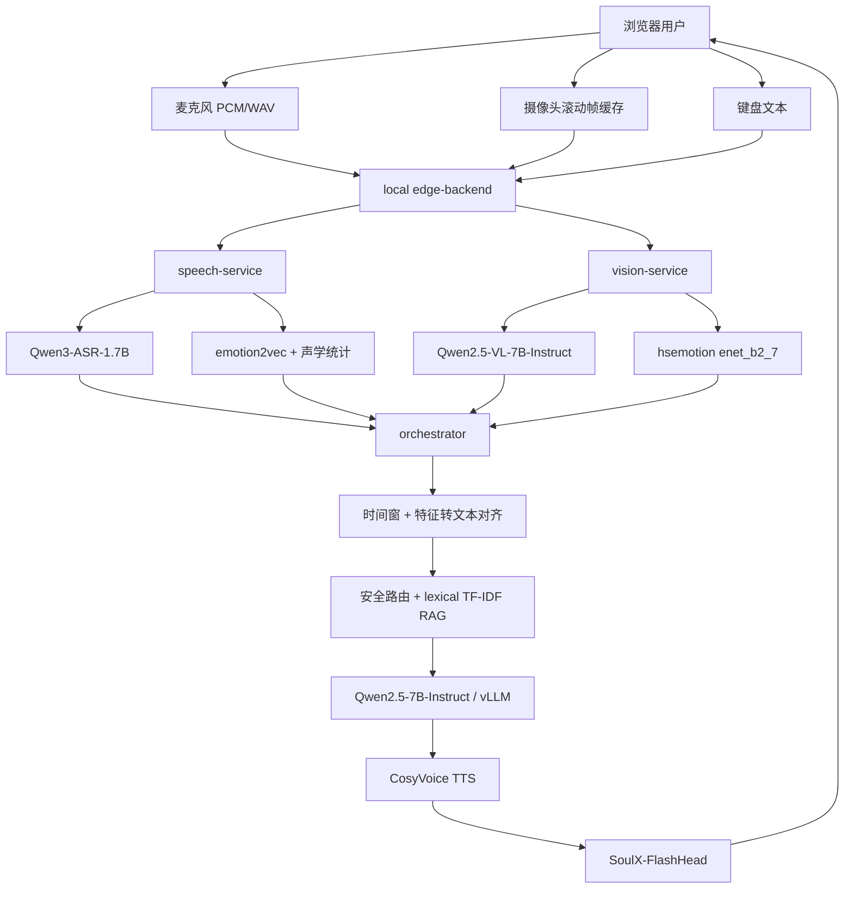
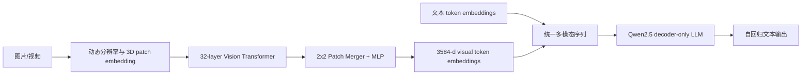

# A22 项目多模态技术详解

> 分析基线：2026-06-12 当前工作区。本文优先以 `scripts/remote/start_remote_stack_tmux.sh` 和实际源码为准，而不是以可能已经过期的 README 或 Compose 示例默认值为准。

## 1. 先给结论

这个项目采用的是**多模型级联、特征级晚融合（late fusion）**，不是一个端到端模型同时处理语音、图像和文本。

核心链路是：

1. `Qwen3-ASR-1.7B` 把语音转成文字。
2. `emotion2vec_plus_base` 和手工声学特征提取语音情绪线索。
3. `Qwen2.5-VL-7B-Instruct` 把若干摄像头关键帧压缩成结构化文字特征。
4. `hsemotion/enet_b2_7` 单独补充人脸表情标签。
5. orchestrator 把 ASR 文本、语音特征、视觉特征拼成一个纯文本提示。
6. `Qwen2.5-7B-Instruct` 作为主对话模型生成回复。
7. `CosyVoice-300M-Instruct` 生成语音，`SoulX-FlashHead-1_3B` 根据参考头像和回复音频生成数字人视频。

因此，项目中的“语音-视觉-文本对齐”分三层：

- **时间层对齐**：同一个 `turn_id`、`stream_id` 和 `TurnTimeWindow`。
- **语义层对齐**：各模态先被压缩成统一的文字字段和情绪标签。
- **提示词层融合**：把这些字段拼入主 LLM 的 user prompt。

当前没有实现以下训练式对齐机制：

- 没有 CLIP 式图文对比学习。
- 没有把语音、视觉和文本投影到同一个 embedding 空间。
- 没有跨模态 cross-attention 融合器。
- 没有学习式门控、置信度加权或端到端联合微调。
- 没有项目自训练的多模态模型权重。

## 2. 当前实际使用的模型

当前 tmux 启动脚本给出的运行模型如下。

| 模块 | 当前模型/实现 | 项目用途 |
| --- | --- | --- |
| 主对话 LLM | `Qwen2.5-7B-Instruct` | 接收文本化后的多模态上下文，生成最终回复 |
| ASR | `Qwen3-ASR-1.7B` | 中文语音转写 |
| 语音情绪 | `emotion2vec_plus_base` | utterance 级情绪分类 |
| 声学统计 | 项目自实现 | 语速、停顿率、RMS、峰值、过零率音高估计 |
| 视觉语义 | `Qwen2.5-VL-7B-Instruct` | 多张关键帧到 JSON 视觉描述 |
| 人脸情绪 | `hsemotion/enet_b2_7` | 最大人脸区域的表情分类 |
| 知识检索 | 项目自实现 lexical TF-IDF | 心理支持知识库检索；不是向量数据库 |
| TTS | `CosyVoice-300M-Instruct` | 回复文字转 WAV |
| 数字人 | `SoulX-FlashHead-1_3B` | 单张参考图 + 音频生成头像视频 |
| 数字人音频编码依赖 | `wav2vec2-base-960h` | SoulX 的音频条件特征 |

几个容易混淆的点：

- 主对话模型不是 Qwen2.5-VL，而是独立的 `Qwen2.5-7B-Instruct`。
- Qwen2.5-VL 只负责把画面变成 `scene_summary`、`attention_target`、`motion_level`、`emotion_tags`。
- `RAG_EMBEDDING_MODEL=BAAI/bge-small-zh-v1.5` 虽然存在于配置，但当前检索代码没有加载 BGE；实际索引元数据明确写的是 `lexical_tfidf`。
- Compose 示例仍以 `CosyVoice2-0.5B` 为默认值，但当前 tmux 主启动脚本使用 `CosyVoice-300M-Instruct`。
- avatar README 仍主要描述 EchoMimic v2，但当前主启动脚本把渲染后端设为 `soulxflashhead`。

## 3. 系统架构和一次对话的完整路径



orchestrator 的执行顺序是串行的：

```text
speech analyze
  -> merge transcript/speech features
  -> vision extract
  -> multimodal alignment
  -> emotion heuristic/service
  -> safety route
  -> RAG retrieval
  -> main LLM
  -> TTS/avatar generation
```

语音和视觉本来可以并行，但当前 `DialogService.build_reply()` 是先 `await speech_client`，再 `await vision_client`，会累加两段推理延迟。

## 4. 语音链路

### 4.1 浏览器采集

前端通过 `getUserMedia` 获取单声道音频，并启用：

- echo cancellation；
- noise suppression；
- auto gain control。

Web Audio 的 `ScriptProcessor(4096, 1, 1)` 持续收集 `Float32` PCM，结束后转换成 PCM16 WAV，再以 Base64 放进请求。

同时浏览器 Speech API 可以产生一个 `client_asr_text`，但它只是提示/降级数据；正常远端路径仍使用 Qwen3-ASR。

### 4.2 Qwen3-ASR 推理

speech-service 使用 `qwen_asr.Qwen3ASRModel.from_pretrained()` 加载 `Qwen3-ASR-1.7B`，CUDA 环境下尝试启用 FlashAttention。音频最终以临时文件路径传给模型。

Qwen3-ASR 官方技术报告描述的基础结构是：

- 音频编码器来自 Qwen3-Omni 的 AuT encoder。
- 1.7B 版本使用 Qwen3-1.7B 作为语言解码器初始化。
- 128 维 Mel filter-bank 输入。
- 原始音频编码器约产生 25 Hz 帧率。
- 经过 2 层、步长为 2 的 Conv2D 下采样到约 12.5 Hz。
- 语言模型词元约 60 token/s，音频特征通常是主要序列长度来源。

项目当前只取转写文本，没有启用 Qwen3-ForcedAligner，也没有得到词级时间戳。

### 4.3 手工声学特征

项目另外对 WAV 做以下统计：

```text
duration = frame_count / sample_rate
RMS = sqrt(sum(x_i^2) / N)
speaking_rate = 文本 token/字符数 / 秒数
pause_ratio = 50 ms 窗口中平均绝对幅度 < 0.015 的窗口比例
pitch_estimate = zero_crossing_count / (2 * duration)
```

注意这里的 `pitch_hz` 是过零率近似，不是 YIN、CREPE、pyworld 或自相关基频估计；对噪声、多谐波和气声的鲁棒性有限。

项目把连续特征再阈值化为标签：

- `pause_ratio >= 0.35` -> `hesitant`
- `rms_energy <= 0.035` -> `fatigued`
- `rms_energy >= 0.18` -> `energized`
- `speaking_rate >= 5.5` -> `agitated`
- `speaking_rate <= 2.2` -> `calm`
- 无命中 -> `steady`

### 4.4 emotion2vec 情绪识别

`emotion2vec_plus_base` 通过 FunASR `AutoModel.generate()` 做 utterance 级分类。项目取最高分标签，低于 `0.2` 则丢弃，并映射到内部标签：

- angry/frustrated/annoyed -> `agitated`
- happy/excited/surprise -> `energized`
- sad/fear/disgust/depressed -> `fatigued`
- neutral/calm -> `calm`

emotion2vec 本身是基于自监督预训练的通用语音情绪表示模型；项目没有抽取它的 embedding，只使用最终分类标签和置信度。

## 5. 视觉链路

### 5.1 关键帧采集

摄像头开启后，前端默认参数为：

| 参数 | 数值 |
| --- | ---: |
| 后台采样间隔 | 1400 ms |
| 浏览器滚动缓存 | 12 s |
| 触发前窗口 | 4 s |
| 触发后窗口 | 0.8 s |
| 前端最多事件帧 | 6 |
| JPEG 质量 | 0.62 |
| 最大边 | 480 px |

触发后，候选帧在 `[trigger - 4s, trigger + 0.8s]` 中均匀下采样。随后 edge-backend 默认又执行一次均匀采样，`LOCAL_VIDEO_FRAME_LIMIT=3`，所以正常情况下送到远端 Qwen2.5-VL 的有效上限是 **3 张图**，不是 6 张或 10 张。

语音轮次中，摄像头触发发生在录音停止之后。因此它主要覆盖语音末尾约 4 秒以及停止后的 0.8 秒，而不是覆盖整段长语音。

### 5.2 Qwen2.5-VL 视觉特征抽取

vision-service 将每个 Base64 JPEG 解码成 RGB PIL Image，然后构造：

```python
content = [
    {"type": "image"},
    {"type": "image"},
    {"type": "image"},
    {"type": "text", "text": prompt},
]
```

这里非常关键：项目把帧作为**多张独立图片**传入，而不是作为 Qwen2.5-VL 的 `video` 输入。因此：

- 可以利用多图理解和图片顺序；
- 不能充分利用原生 video grid 的时间轴；
- 没有把真实 FPS 或逐帧时间戳交给模型；
- Qwen2.5-VL 的 absolute time encoding / dynamic FPS 能力基本没有在项目中发挥。

模型被要求只输出严格 JSON：

```json
{
  "scene_summary": "short text",
  "attention_target": "camera|screen|downward|sideward|unknown",
  "motion_level": "still|low|moderate|high",
  "emotion_tags": ["calm", "fatigued", "tense", "sad", "neutral"]
}
```

如果模型加载、生成或 JSON 解析失败，服务不会中断，而是返回 `remote_qwen_vl_fallback`，此时只有非常弱的默认描述。

### 5.3 人脸表情识别

Qwen2.5-VL 之外，项目还用 `hsemotion` 的 `enet_b2_7` 做独立 FER：

1. 最多取前 4 帧；由于 edge 限制，通常最多实际处理 3 帧。
2. 用 OpenCV Haar cascade 检测正脸。
3. 取面积最大的人脸框。
4. 若未检测到脸，退回整帧做分类。
5. 只保留置信度不低于 0.2 的结果。
6. 按多帧标签分数求和，取累计分最高的标签。

内部映射为：

- anger/fear/disgust -> `tense`
- sad -> `sad`
- happy/surprise -> `calm`
- 其他 -> `neutral`

这里把 `surprise` 映射成 `calm` 是业务规则，不是模型原始定义。

## 6. 项目的多模态对齐到底怎么做

### 6.1 时间对齐

公共契约 `TurnTimeWindow` 包含：

- `window_id`
- `stream_id`
- `sequence_id`
- `capture_started_at_ms` / `capture_ended_at_ms`
- `audio_started_at_ms` / `audio_ended_at_ms`
- `video_started_at_ms` / `video_ended_at_ms`
- `triggered_at_ms`
- `pre_roll_ms` / `post_roll_ms`

浏览器使用 epoch milliseconds，音频和视频携带同一轮的窗口对象。远端视觉服务再根据时间范围从 session/stream ring buffer 中选帧。

不过当前对齐只做“是否落在窗口内”的筛选，没有：

- 音素/单词到帧的精细对齐；
- 每句话到面部表情变化的时间配准；
- 动态时间规整 DTW；
- 音频和视频时钟漂移校正；
- 跨客户端时钟同步。

因此更准确的名称是**turn-level/event-window alignment**，不是 frame-word alignment。

### 6.2 语义对齐

ASR 文本成为 `canonical_user_text`。语音和视觉特征被转成字符串：

```text
Speech cues: emotion tags: fatigued, hesitant; speaking rate: 1.8; pause ratio: 0.42; ...
Vision cues: scene summary: ...; attention target: downward; motion level: low; emotion tags: sad
```

再拼成主 LLM 用户输入：

```text
Alignment mode: video_audio
User utterance: 我最近总是睡不好
Speech cues: ...
Vision cues: ...
```

这就是当前最主要的跨模态“对齐与融合”。主 LLM 看到的仍然全部是文本 token。

### 6.3 情绪融合

独立 emotion-service 默认关闭，因此实际使用 heuristic：

1. 如果语音标签和视觉标签有交集，取第一个交集标签。
2. 否则优先取视觉第一个标签。
3. 再否则取语音第一个标签。
4. 所有标签按语音在前、视觉在后去重合并。

这个策略没有利用：

- emotion2vec 的原始置信度；
- hsemotion 的原始置信度；
- ASR 置信度；
- 模态可靠性；
- 历史平滑；
- 冲突检测。

### 6.4 安全路由和 RAG 也使用多模态标签

安全路由先检查文字中的高风险短语，再根据语音/视觉标签补充主题：

- `agitated` 或 `tense` -> anxiety
- `sad` 或 `fatigued` -> depression
- `hesitant` 或 `calm` -> emotion regulation

RAG 查询由用户文本、speech context、vision context 共同组成。

当前 RAG 是词法 TF-IDF：

- 中文连续文本块、二元组、三元组 tokenization；
- `tf * idf` 权重；
- cosine similarity；
- topic/source/risk metadata boost；
- 默认 `top_k=4`、`min_score=0.08`。

## 7. 主对话模型

主模型通过 vLLM OpenAI-compatible API 部署：

- 模型：`Qwen2.5-7B-Instruct`
- 最大上下文：项目启动参数 `4096`
- 最大并发序列：`2`
- vLLM GPU memory utilization：`0.28`
- orchestrator temperature：`0.4`
- 单轮最大输出：`256` token
- 保存最近上下文，并维护简单会话摘要

system prompt 中还会拼入 RAG 片段和医疗/危机回复边界。

这意味着最终回答质量主要由 Qwen2.5-7B-Instruct 决定；Qwen2.5-VL 的结果只是其中几行辅助文字。

## 8. 数字人输出链路

### 8.1 情绪风格和动作

当前 `policy_service` 主要依据 ASR 文本和 speech tags 选择：

- `emotion_style`
- `facial_expression`
- `head_motion`

视觉标签当前不会直接进入该动作策略。因此即使视觉识别到 `sad`，如果语音和文本没有相应信号，也不一定改变数字人的表情动作。

### 8.2 CosyVoice

TTS 风格映射会给出：

- instruction 文本；
- speed；
- 固定中文女声 speaker id。

但当前运行模式是 `cosyvoice_300m_instruct`，项目的安全分支为了避免模型把控制提示本身读出来，会优先调用 `inference_sft` 或普通文本接口。因此实际稳定生效的通常是 speaker 和 speed；instruction 风格控制不一定进入模型。

### 8.3 SoulX-FlashHead

SoulX 启动命令使用：

- `SoulX-FlashHead-1_3B` checkpoint；
- `wav2vec2-base-960h` 音频编码依赖；
- 单张 reference image；
- `model_type=lite`；
- stream audio encoding；
- 25 FPS 输出。

项目还输出 `viseme_seq`、`expression_seq`、`motion_seq` 契约。但当前 viseme 是按字符循环映射到 `a/e/i/o/u/m`，再按总音频时长均匀分配，不是基于中文音素、ASR forced alignment 或 TTS 音素时长的精确口型对齐。SoulX 生成的 MP4 则主要依赖其音频驱动网络。

## 9. Qwen2.5-VL 原生架构

### 9.1 总体结构

Qwen2.5-VL 是典型的“视觉编码器 + token merger + decoder-only LLM”结构：



官方实现不是把图片先生成 caption 再喂给内部 LLM。原生 Qwen2.5-VL 会：

1. 视觉编码器生成 visual embeddings。
2. 文本序列中预留 `<|image_pad|>` 或 `<|video_pad|>` 占位 token。
3. 用 mask 把这些占位位置替换为 visual embeddings。
4. 视觉 token 和文本 token 一起进入 Qwen2.5 解码器做 self-attention。

这属于**模型内部 early/intermediate fusion**。项目外围则在 Qwen2.5-VL 生成 JSON 后再交给另一个文本模型，属于系统级 late fusion。

### 9.2 视觉 patch embedding

7B 官方配置：

- `patch_size = 14`
- `temporal_patch_size = 2`
- `spatial_merge_size = 2`
- `hidden_size = 1280`

输入首先经过 kernel/stride 为 `(2, 14, 14)` 的 Conv3D patch embedding。原始 patch token 数近似为：

```text
N_raw = grid_t * (H' / 14) * (W' / 14)
```

其中 `H'`、`W'` 是动态 resize 后的尺寸。

Patch Merger 每 `2 x 2` 个空间 token 合并一次，因此最终送入 LLM 的视觉 token 数约为：

```text
N_visual = grid_t * (H' / 28) * (W' / 28)
```

### 9.3 动态分辨率

Qwen2.5-VL 不强制把所有图缩到固定 224x224。官方 processor 根据原始长宽动态产生不同数量的 token，同时把尺寸调整为模型 patch/merge 因子的整数倍。

官方默认 processor 配置的像素边界是：

- `min_pixels = 3136 = 56 x 56`
- `max_pixels = 12,845,056 = 16,384 x 28 x 28`

项目没有显式设置 `min_pixels/max_pixels`，但前端已经把最大边限制到 480，所以 token 数不会接近官方最大值。

以 640x360 摄像头画面缩到约 480x270 为例，processor 通常会调整到接近 476x280：

```text
单帧视觉 token ~= (476 / 28) * (280 / 28) = 17 * 10 = 170
3 帧多图输入 ~= 510 visual tokens
```

这是近似值，最终以 processor 返回的 `image_grid_thw` 为准。

### 9.4 Vision Transformer

7B vision encoder 的主要参数：

| 参数 | 数值 |
| --- | ---: |
| depth | 32 |
| hidden size | 1280 |
| intermediate size | 3420 |
| attention heads | 16 |
| patch size | 14 |
| temporal patch size | 2 |
| spatial merge size | 2 |
| window size | 112 |
| full-attention blocks | 7, 15, 23, 31 |
| vision output size | 3584 |

Qwen2.5-VL 对视觉编码器做了几项重要改造：

- 大部分层使用 window attention，减少长视觉序列的二次复杂度。
- 第 7、15、23、31 层使用 full attention，保留全局信息交换。
- 视觉位置编码采用 2D RoPE，而不是传统绝对位置 embedding。
- ViT 中使用 RMSNorm 和 SwiGLU，使结构更接近 Qwen2.5 LLM。

### 9.5 Patch Merger

视觉编码器输出先做 normalization，再将相邻 `2 x 2` token 拼接，输入两层 MLP：

```text
4 * 1280 = 5120-d concatenated feature
5120 -> 5120 -> GELU -> 3584
```

最终维度 3584 与 7B 语言模型 hidden size 一致，因此可直接放入语言 token 序列。

### 9.6 语言模型部分

Qwen2.5-VL-7B 的语言骨干配置：

| 参数 | 数值 |
| --- | ---: |
| hidden size | 3584 |
| decoder layers | 28 |
| query attention heads | 28 |
| KV heads | 4 |
| head dimension | 128 |
| MLP intermediate size | 18944 |
| vocabulary size | 152064 |
| max position embeddings | 128000 |
| RoPE theta | 1,000,000 |
| RMSNorm epsilon | 1e-6 |

语言骨干继承 Qwen2.5 的 decoder-only Transformer 设计：

- RoPE；
- RMSNorm；
- SwiGLU；
- attention Q/K/V bias；
- GQA（28 个 query heads，共享 4 个 KV heads）。

官方技术报告给出的 Qwen2.5-VL-7B 总参数量约为 **8.29B**；“7B”主要对应语言模型规格，不等于整个多模态模型的精确总参数。

### 9.7 M-RoPE：多模态旋转位置编码

Qwen2.5-VL 使用 Multimodal Rotary Position Embedding。视觉 token 的位置不是一个简单的一维序号，而是拆成：

- temporal position；
- height position；
- width position。

7B 配置中的 `mrope_section = [16, 24, 24]` 控制不同频率段在时间、高度、宽度轴上的分配。

文本 token 的三个位置轴使用同一个一维位置值；图片/视频 token 则使用三维坐标。这样所有模态仍能进入同一个 self-attention 序列。

### 9.8 Dynamic FPS 和绝对时间编码

Qwen2.5-VL 相比 Qwen2-VL 的关键升级之一是视频时间理解：

- 可以按不同 FPS 动态采样视频；
- temporal position 根据实际时间间隔增长；
-模型可以学习事件发生在第几秒，而不只是第几个采样帧。

官方实现通过 `second_per_grid_ts` 和 `tokens_per_second` 等信息计算 temporal IDs。

但是本项目传的是多张 `image`，不是 `video`，也没有传 `fps`/`second_per_grid_ts`，所以当前项目不能声称已经完整使用这套原生时间编码。

### 9.9 原生模型训练阶段

Qwen2.5-VL 技术报告给出三阶段训练：

1. **Stage 1：视觉预训练**
   - 冻结 LLM，只训练 ViT。
   - 主要图文对、知识、OCR 数据。
   - 约 1.5T token。
2. **Stage 2：全参数多模态预训练**
   - 解冻全部参数。
   - 加入更广泛的图文、视频、agent、纯文本数据。
   - 序列长度提升到 32,768。
   - 累计约 2T token。
3. **Stage 3：长上下文指令微调**
   - 冻结 ViT，训练 LLM。
   - 指令数据和长视频数据。
   - 最大序列长度 131,072。

报告还说明模型进行了 instruction tuning、直接偏好优化（DPO）等后训练。

## 10. 原生 Qwen2.5-VL 与本项目用法的区别

| 项目 | 原生 Qwen2.5-VL | 当前 A22 项目 |
| --- | --- | --- |
| 图文融合 | visual embeddings 直接替换视觉占位 token | VL 先生成 JSON，再转文本给另一个 LLM |
| 视频输入 | video tensor + temporal grid + FPS/秒信息 | 多张独立 image |
| 时间编码 | M-RoPE temporal IDs + absolute time | 仅外部窗口时间戳，模型内部未使用 |
| 对话生成 | 同一个 VL 模型可看图并直接回答 | Qwen2.5-VL 只做预处理，Qwen2.5-7B 回答 |
| 情绪融合 | 可在上下文内隐式推理 | 标签规则 + 文本提示 |
| 训练 | 海量多模态联合预训练 | 项目无联合训练，仅推理编排 |

这种项目方案的优点是模块独立、容易替换、容易排障、适合比赛快速集成；代价是信息在 JSON/标签化过程中被压缩，且两个 7B 模型带来显存和延迟开销。

## 11. 当前技术局限

### 11.1 对齐精度

- 只有 turn/event-window 级对齐。
- 长语音主要只匹配末尾约 4 秒视觉画面。
- 没有词级 ASR 时间戳。
- Qwen2.5-VL 看不到逐帧真实时间。
- 没有计算音频窗与视频窗的 overlap ratio。

### 11.2 信息损失

Qwen2.5-VL 的视觉 embedding 被压缩为 4 个字段，主 LLM 无法回看原图。细节一旦未写入 `scene_summary` 就永久丢失。

### 11.3 情绪置信度

- 多模态 dominant emotion 没有置信度加权。
- FER 的最终 confidence 是累计标签分数占比，不是校准后的单帧模型概率。
- Qwen3-ASR 路径通常没有返回 transcript confidence。
- 标签映射是业务启发式，存在语义过度压缩。

### 11.4 视觉动作策略未闭环

视觉标签进入主 LLM和 RAG 路由，但没有直接驱动 `emotion_style` 和 avatar action。

### 11.5 RAG 配置与实现不一致

存在 embedding model 配置项，但实际没有 embedding 检索。这一点在答辩中应准确表述为“轻量级 TF-IDF RAG”，不要说成“BGE 向量知识库”。

### 11.6 性能和显存

所有服务默认映射到 GPU 0，同时可能驻留：

- Qwen2.5-7B-Instruct；
- Qwen2.5-VL-7B-Instruct；
- Qwen3-ASR-1.7B；
- emotion2vec；
- CosyVoice；
- SoulX。

这会带来显存竞争、CUDA 上下文切换和串行延迟。当前关闭部分 warmup 可降低启动峰值，但会增加首轮冷启动。

## 12. 推荐升级顺序

### P0：低风险、直接提升效果

1. 用 `asyncio.gather()` 并行调用 speech-service 和 vision-service。
2. 在多模态结果里保留每个模型的原始标签、置信度和 source。
3. 计算 `audio/video overlap_ms` 和 overlap ratio，低重叠时降低视觉权重。
4. 把视觉标签纳入 avatar emotion/action 策略。
5. 将 `pitch_hz` 改为 pyworld、librosa.pyin 或 CREPE。
6. 明确 RAG 为 lexical TF-IDF，或真正接入 BGE embedding。

### P1：正确使用 Qwen2.5-VL 视频能力

1. 将事件窗口帧按视频输入组织，而不是多个 image placeholder。
2. 传入采样 FPS 或 `second_per_grid_ts`。
3. 保留逐帧 timestamp，并在 prompt 中说明真实相对秒数。
4. 根据运动、人脸清晰度和表情变化选关键帧，而不是纯均匀采样。

### P2：减少双 7B 模型的信息损失

可以让 Qwen2.5-VL 同时承担视觉理解和最终回复：

- ASR/语音情绪仍由语音服务产生；
- 把 ASR 文本、声学特征、原始关键帧一起交给 Qwen2.5-VL；
- 直接生成最终答复。

这样主 LLM 可以直接回看视觉 token，不再依赖 4 字段 JSON；同时可取消独立 Qwen2.5-7B 服务。但需要重新评估吞吐、prompt 稳定性和心理安全边界。

### P3：学习式融合

若后续有标注数据，可做：

- 各模态置信度校准；
- 小型 gated fusion network；
- LoRA/SFT，让模型学习如何解释语音与视觉情绪线索；
- 对语音-表情冲突样本做专门训练；
- 输出情绪分布而非单标签。

在当前比赛阶段，不建议直接从零训练端到端多模态模型，工程收益通常低于改进时间对齐、提示设计和评测。

## 13. 建议评测

至少做以下消融：

| 实验 | 目的 |
| --- | --- |
| text only | 主模型基线 |
| text + ASR acoustic tags | 验证语音线索增益 |
| text + VL summary | 验证视觉语义增益 |
| text + FER only | 验证专用人脸情绪模型增益 |
| full multimodal | 验证整体融合 |
| full minus RAG | 验证知识库作用 |
| multi-image vs video input | 验证 Qwen2.5-VL 时间建模增益 |

指标建议：

- ASR：CER/WER；
- SER/FER：macro-F1、UAR、ECE；
- 多模态情绪：macro-F1、冲突样本准确率；
- 对话：人工共情评分、安全评分、事实性、任务完成率；
- 性能：首 token 延迟、整轮延迟、首音频延迟、首视频帧延迟、峰值显存；
- 稳定性：20 轮连续对话成功率、模型降级率、JSON 解析失败率。

## 14. 关键源码入口

- 真实启动配置：`scripts/remote/start_remote_stack_tmux.sh`
- 语音主流程：`remote/speech-service/services/asr_runtime.py`
- 声学特征：`remote/speech-service/services/feature_extractor.py`
- emotion2vec：`remote/speech-service/services/speech_emotion_runtime.py`
- Qwen2.5-VL：`remote/vision-service/services/qwen_vl_runtime.py`
- FER：`remote/vision-service/services/facial_emotion_runtime.py`
- 视频时间窗：`local/frontend/src/video/cameraTurnRecorder.js`
- 远端视频 ring buffer：`remote/vision-service/services/video_ring_buffer.py`
- 多模态对齐：`remote/orchestrator/services/alignment/multimodal_alignment_service.py`
- 全链路编排：`remote/orchestrator/services/dialog_service.py`
- 情绪融合：`remote/orchestrator/adapters/emotion_client.py`
- RAG 索引：`remote/orchestrator/services/rag/index.py`
- TTS：`remote/avatar-service/services/tts_runtime.py`
- 数字人渲染：`remote/avatar-service/services/soulxflashhead_render_bridge.py`

## 15. 官方资料

- Qwen2.5-VL Technical Report: https://arxiv.org/abs/2502.13923
- Qwen2.5 Technical Report: https://arxiv.org/abs/2412.15115
- Qwen2.5-VL official repository: https://github.com/QwenLM/Qwen2.5-VL
- Qwen2.5-VL-7B official config: https://huggingface.co/Qwen/Qwen2.5-VL-7B-Instruct/blob/main/config.json
- Qwen2.5-VL official processor config: https://huggingface.co/Qwen/Qwen2.5-VL-7B-Instruct/blob/main/preprocessor_config.json
- Transformers Qwen2.5-VL implementation: https://github.com/huggingface/transformers/blob/v4.57.6/src/transformers/models/qwen2_5_vl/modeling_qwen2_5_vl.py
- Qwen3-ASR Technical Report: https://arxiv.org/abs/2601.21337
- Qwen3-ASR-1.7B official model card: https://huggingface.co/Qwen/Qwen3-ASR-1.7B
- emotion2vec paper: https://arxiv.org/abs/2312.15185
- hsemotion repository: https://github.com/HSE-asavchenko/face-emotion-recognition
- CosyVoice repository: https://github.com/FunAudioLLM/CosyVoice
- SoulX-FlashHead repository: https://github.com/Soul-AILab/SoulX-FlashHead
