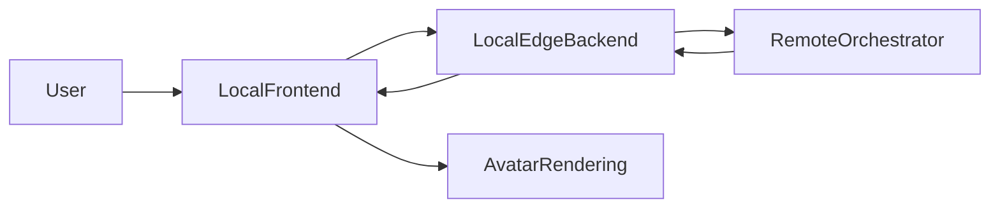

# A22 System Design v3

## 1. 当前版本定位

本版本用于记录 A22 项目在 **“local 真转发 + local 产品壳 + remote 模块化雏形”** 阶段的系统状态。

相对于 `System_Design/version2/ARCHITECTURE.md`，当前已经新增了以下能力：

- `local/edge-backend` 已从单文件 mock 改为模块化边缘后端
- `local/frontend` 已从 demo 单文件页面改为 A/B/C 三栏产品壳
- `remote/orchestrator` 已从单文件 mock 改为模块化认知入口雏形
- 系统已经具备 `frontend -> edge-backend -> remote/orchestrator -> frontend` 的代码级闭环
- 系统已经具备文本输入和第一版音频输入骨架

## 2. 当前职责划分

### Local

- 负责前端界面渲染
- 负责文本输入与第一版音频采集
- 负责轻量预处理
- 负责会话转发
- 负责结构化结果展示
- 负责数字人 2D 占位渲染

### Remote

- 负责统一接收 local 转发的请求
- 负责对话状态维护
- 负责规则驱动的语义回复
- 负责动作策略生成
- 为后续 `LLM / ASR / TTS / 多模态融合` 预留 adapter 边界

## 3. 当前系统数据流



### 文本链路

1. 用户在 `local/frontend` 输入文本
2. 前端调用 `/api/chat`
3. `nginx` 将 `/api/chat` 转发到 `local/edge-backend`
4. `edge-backend` 归一化请求并补全 `session_id / turn_id`
5. `edge-backend` 使用 `httpx` 转发到 remote `/chat`
6. `remote/orchestrator` 生成 `reply_text / emotion_style / avatar_action`
7. 前端渲染聊天消息、状态栏和数字人动作占位

### 音频链路

1. 浏览器通过 `MediaRecorder` 录音
2. 前端将音频转为 `base64`
3. `edge-backend` 将无文本但有音频的请求归一化为 `input_type=audio`
4. `remote/orchestrator` 当前先通过 placeholder ASR 处理
5. remote 返回音频轮次对应的情绪与动作策略

## 4. 当前目录结构变化

```text
A22/
├─ System_Design/
│  ├─ version1/
│  ├─ version2/
│  └─ version3/
├─ local/
│  ├─ frontend/
│  │  └─ src/
│  │     ├─ api/
│  │     ├─ ui/
│  │     ├─ main.js
│  │     └─ styles.css
│  └─ edge-backend/
│     ├─ app.py
│     ├─ config.py
│     ├─ models.py
│     ├─ routes/
│     └─ services/
├─ remote/
│  └─ orchestrator/
│     ├─ app.py
│     ├─ models.py
│     ├─ routes/
│     ├─ services/
│     └─ adapters/
├─ compose.local.yaml
├─ compose.remote.yaml
└─ infra/nginx/default.conf
```

## 5. 当前代码进度判断

### 已完成

- `local/frontend` 已具备三栏页面壳
- `local/frontend` 已具备消息区、状态区、数字人占位区
- `local/frontend` 已具备文本发送
- `local/frontend` 已具备第一版音频录制与上传
- `local/edge-backend` 已具备真实转发、超时处理、错误映射
- `remote/orchestrator` 已具备规则回复、会话记忆、策略输出

### 已经打通到什么程度

- 代码结构层面已经打通 `frontend -> edge-backend -> remote/orchestrator -> frontend`
- 运行层面只要 remote 可访问，前端即可看到真实 remote 返回

### 还没有完成的部分

- 真实 `LLM` 接入
- 真实 `ASR` 接入
- 真实 `TTS` 接入
- 视频输入与轻量视觉特征处理
- 高保真数字人
- `Lip-sync`
- 远端多模态融合主逻辑

## 6. 当前最关键的运行注意点

当前最重要的运行配置问题在 `compose.local.yaml`：

- 文件：`compose.local.yaml`
- 位置：`edge-backend.environment.CLOUD_API_BASE`
- 当前值：`http://replace-with-remote-server`

这意味着：

- 如果你直接用当前 `compose.local.yaml` 启动 `edge-backend`
- 但没有把这个值改成真实 remote 地址
- 那么本地边缘后端虽然会启动成功，但 `/chat` 无法真正请求到 remote

### 推荐配置

如果你的 SSH 隧道已经在本机 WSL 里把：

- `127.0.0.1:19000 -> remote 127.0.0.1:19000`

打通，那么容器里推荐把 `CLOUD_API_BASE` 配成：

```text
http://host.docker.internal:19000
```

这样 `edge-backend` 容器才能访问宿主机上的 SSH 隧道入口。

## 7. 当前结论

当前项目已经从 `version2` 的“骨架阶段”进入了“第一轮联调阶段”。

最准确的判断是：

- 架构方向已经确定
- local 与 remote 的边界已经清晰
- 第一版页面和第一版转发逻辑已经落地
- 接下来应继续沿着 remote 能力接入和本地数字人增强推进
