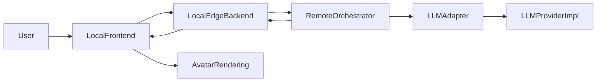

# A22 System Design v4

## 1. 当前版本定位

本版本用于记录 A22 项目在 **“文本主链路打通 + local/remote 模块化完成 + remote LLM 接入准备完成”** 阶段的系统状态。

相对于 `System_Design/version3/ARCHITECTURE.md`，当前版本新增的核心进展是：

- local 与 remote 的核心通信格式已抽离为共享 schema
- remote 已完成 provider-neutral 的 LLM adapter 骨架
- remote 已具备多轮文本上下文管理基础层
- remote 的 dialog 编排逻辑已从简单规则调用升级为“上下文 -> LLM adapter -> 结构化响应”主线
- 当前系统已经具备接入真实 `Qwen2.5-7B-Instruct` 等模型前的工程准备

## 2. 当前系统阶段判断

当前 A22 项目已经不再是纯骨架阶段，而是进入了：

**“文本智能接入前夜”**

更准确地说：

- local 侧产品壳已具备可用交互能力
- local 到 remote 的 HTTP 转发链路已成立
- remote 的规则回复系统已被改造成可替换 LLM 架构
- 下一步的真正重点是：把 mock/fallback 的 LLM provider 换成真实模型 provider

## 3. 当前总体架构



## 4. 当前职责划分

### Local Frontend

负责：

- 文本输入
- 第一版音频录制
- 聊天消息展示
- 状态栏展示
- 数字人 2D 占位展示
- 将输入发送到 `/api/chat`

### Local Edge Backend

负责：

- 接收前端请求
- 生成或补齐 `session_id / turn_id`
- 轻量输入归一化
- 转发 remote `/chat`
- timeout、错误处理、响应透传

### Remote Orchestrator

负责：

- 接收来自 local 的统一请求
- 构造多轮文本上下文
- 生成 system prompt 与上下文摘要
- 调用统一的 LLM adapter
- 生成结构化响应：
  - `reply_text`
  - `emotion_style`
  - `avatar_action`
  - `response_source`
  - `context_summary`
  - `reasoning_hint`

## 5. 当前最重要的新变化

### 5.1 通信格式已共享化

当前 local 与 remote 的核心通信定义已经抽离到：

- `shared/contracts/schemas.py`

该文件现在是通信字段的单一事实来源，集中定义：

- `ChatRequestSchema`
- `AvatarActionSchema`
- `ChatResponseSchema`
- `ErrorResponseSchema`

这意味着：

- 后续若修改 local 与 remote 共同使用的核心字段
- 优先修改 `shared/contracts/schemas.py`
- local 与 remote 会直接复用该定义

### 5.2 remote 已具备 LLM adapter 骨架

当前 remote 已具备以下能力：

- `LLMRequest`
- `LLMResult`
- `BaseLLMProvider`
- `MockLLMProvider`
- `FallbackLLMProvider`
- `LLMClient`

当前默认配置仍是：

- `LLM_PROVIDER=mock`
- `LLM_MODEL=mock-support-v1`

因此现在的真实状态是：

- 已经具备接入真实 LLM 的架构
- 但尚未接入真实模型服务

### 5.3 上下文管理已升级

当前 `remote/orchestrator/services/session_state.py` 不再只是简单记录文本列表，而是保存：

- `role`
- `content`
- `turn_id`
- `input_mode`

并支持：

- `build_context_messages(session_id)`
- `get_summary(session_id)`

这使得后续真实 LLM 可以直接使用 session 历史。

## 6. 当前接口状态

当前主接口仍保持：

- `GET /health`
- `POST /chat`

其中 `POST /chat` 的核心字段保持兼容：

- `session_id`
- `turn_id`
- `user_text`
- `input_type`
- `reply_text`
- `emotion_style`
- `avatar_action`

当前新增的兼容扩展字段包括：

- `response_source`
- `context_summary`
- `reasoning_hint`

这些扩展字段已经同步到：

- `shared/contracts/api_v1.md`
- `shared/contracts/chat_response.example.json`
- local / remote 模型定义

## 7. 当前代码进度

### 已完成

- 本地前端页面结构和文本输入流程稳定
- 本地 edge-backend 转发 remote 已稳定
- remote 侧 LLM 接入骨架完成
- 共享通信 schema 已落地
- 文本多轮上下文基础层已准备好
- 当前前后端文本链路可以继续运行且兼容新增字段

### 当前仍未完成

- 真实 LLM provider 接入
- 真实 ASR provider 接入
- 真实 TTS provider 接入
- 视频输入与轻量视觉特征链路
- 多模态对齐与融合主逻辑
- 高保真数字人、口型同步、动作精细控制

## 8. 当前建议的下一阶段开发顺序

推荐顺序如下：

1. 接入 remote 真实文本 LLM
2. 保持现有结构化协议不被破坏
3. 先完成多轮文本对话验证
4. 再进入音频输入全链路
5. 最后再做视觉输入、多模态融合与数字人增强

当前最不应该做的是：

- 先做重视频流
- 先做高保真数字人
- 在 local 做完整多模态认知主逻辑

## 9. 关于 Qwen2.5-7B-Instruct 的接入位置

当前推荐做法是：

- 在实验室服务器上将 `Qwen2.5-7B-Instruct` 作为独立模型服务部署
- 模型权重存放在 `/data/models/Qwen2.5-7B-Instruct`
- `remote/orchestrator` 通过 `llm_client` 调用该模型服务

推荐链路为：

```text
frontend
-> local/edge-backend
-> remote/orchestrator
-> qwen model service
-> remote/orchestrator
-> local/edge-backend
-> frontend
```

不建议：

- 直接把模型推理逻辑硬编码进 orchestrator 主文件
- 把权重下载到 `/home`

## 10. 当前结论

当前项目最准确的判断是：

- local 产品壳已可用
- local 到 remote 的文本链路已打通
- remote 已完成 LLM 接入前的工程准备
- 共享通信格式已集中管理
- 下一步应正式进入 **真实文本 LLM 接入阶段**

一句话总结：

**A22 现在已经把“会收消息、会转发、会返回结构化响应”的系统搭好了，下一步就是让 remote 端真正接上模型，让系统开始具备真实智能。**
