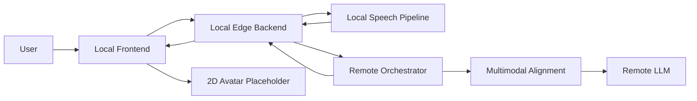

# A22 System Design v5

## 1. Current Position

This version records the project after the Stage2 audio-input upgrade was added on top of the existing text chain and remote LLM integration.

Compared with version4, the system now includes:

- frontend microphone-based voice turn capture
- single-turn single-modality input control
- local audio preprocessing and speech-feature extraction
- shared request schema extensions for audio and future vision alignment
- remote multimodal alignment service with video placeholders

## 2. Current Stage

The current project stage is:

**"Real LLM integrated + Stage2 audio pipeline scaffolded end-to-end"**

More concretely:

- remote LLM access is already integrated in the running server environment
- frontend now supports text turns and audio turns as two distinct interaction modes
- local edge-backend now normalizes audio into canonical text plus speech-side features
- remote orchestrator now performs multimodal alignment before sending the turn into the LLM

## 3. Interaction Rule

Each user turn must have exactly one primary input mode:

1. `text`
2. `audio`

The product rule is:

- one turn should not contain typed text and microphone audio at the same time
- audio input is treated as one complete turn from "start recording" to "stop recording"
- after audio capture starts, the text box is locked for that turn

## 4. Current Architecture

## 5. Frontend Changes

The frontend still keeps the original text-send workflow, but now adds an audio-turn control in the input panel.

Implemented behavior:

- the area below `Send turn` is now the voice-turn entry point
- first click starts microphone capture
- second click stops capture and submits the audio turn
- while recording, text input is disabled
- the audio turn is auto-submitted after recording stops

New frontend module split:

- `local/frontend/src/audio/audioTurnRecorder.js`
- `local/frontend/src/audio/browserSpeechHint.js`
- `local/frontend/src/audio/recorderStates.js`

This keeps recording logic separate from `InputBar.js`.

## 6. Local Edge Backend Changes

The local backend is no longer only a forwarding layer for audio turns. It now contains a dedicated local speech preprocessing stage.

New local modules:

- `services/audio/wav_utils.py`
- `services/audio/feature_extractor.py`
- `services/audio/transcription_service.py`
- `services/audio/audio_turn_service.py`

Current local audio responsibilities:

- decode browser audio payload
- normalize audio metadata
- generate canonical text for remote forwarding
- extract speech-side features such as:
  - speaking rate
  - pause ratio
  - energy
  - pitch estimate
  - emotion tags

The ASR layer is provider-oriented:

- default path uses browser transcript hints when available
- a future local model path is reserved through `LOCAL_ASR_PROVIDER=faster_whisper`

## 7. Shared Contract Changes

The shared schema now supports Stage2 audio alignment fields.

New request-level capabilities include:

- `text_source`
- `client_asr_text`
- `client_asr_source`
- `audio_sample_rate_hz`
- `audio_channels`
- `audio_meta`
- `speech_features`
- `vision_features`
- `alignment_mode`

`vision_features` is intentionally reserved even though video is not implemented yet.

## 8. Remote Orchestrator Changes

Remote orchestration now includes a separate multimodal alignment stage before the LLM call.

New remote module:

- `remote/orchestrator/services/alignment/multimodal_alignment_service.py`

Current remote responsibilities for Stage2:

- receive canonical text from local
- read speech-side features from local
- preserve a placeholder interface for future video features
- convert the current turn into an aligned LLM-ready prompt fragment
- keep LLM output as text

At this stage, the LLM output remains:

- `reply_text`

Structured rendering hints still remain in the response:

- `emotion_style`
- `avatar_action`

These hints are for the future digital-human behavior layer and do not replace the text response.

## 9. Current Completion Summary

### Completed

- real remote LLM chain integrated outside GitHub monorepo
- frontend text turn flow
- frontend audio turn capture flow
- local audio preprocessing scaffold
- shared audio-aware contracts
- remote multimodal alignment scaffold
- edge-backend bridge tracing and run-scoped observability
- text-only LLM output path preserved

### Not completed yet

- production-grade local ASR model deployment
- real video feature extraction
- video-text and video-audio alignment implementation
- TTS generation from reply text
- lip-sync and facial action generation
- high-fidelity digital human rendering

## 10. Recommended Next Step

The next recommended implementation order is:

1. validate the new audio-only turn flow end-to-end
2. replace browser transcript hints with a true local ASR model
3. tune speech-feature extraction for emotional-state usefulness
4. add `vision_features` producers on the local side
5. connect text output to digital-human speech and animation services

## 11. Observability

The current implementation now treats one service runtime from container start to container stop as one complete logging run.

Current observability behavior:

- log run start on FastAPI startup
- log run stop on FastAPI shutdown
- log chat request receive, preprocessing, remote bridge traffic, response, and error paths
- write backend-to-remote bridge traces into host-visible `logs/edge-backend`
- provide a terminal listener script at `a22_demo/listen_bridge.py`

python3 /home/siyuen/docker_ws/A22/a22_demo/listen_bridge.py

